# runtime-next 状态机图（当前工作区/P5 初步实现态）

> 本文按当前工作区 `src/runtime-next` 代码绘制，不按 `HEAD` 绘制。
> 只记录代码事实；类型存在但没有写入路径的状态会单独标注为未激活。

## 阅读规则

- `TransactionRunner.stage`、`ProjectionSnapshot` 状态、`PhysicalScrollMetrics` flags、pending intent、segment revision、writer arbitration、DOM input/observer、React adapter 是不同状态轴。
- P5 已接入 input、observer、custom scrollbar、direct scroll、wheel boundary、momentum latch、drag handoff 和 motion writer。
- `ViewportPhase.MOTION_ACTIVE`、`BootstrapState.MEASURING`、`BootstrapState.STABILIZING` 仍没有运行时写入路径。
- `destinationSettled` 仍只有事件类型，没有发射点。
- `segmentRelayoutState: pending/running`、`adjacentPrefetch*: in-flight` 仍只有类型，没有当前写入路径。

## 1. Runtime 生命周期

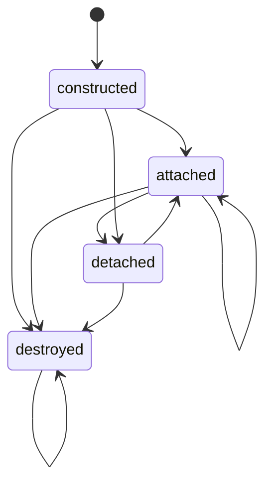

代码事实：

- `attach(container)`：DOM registry attach，input controller attach，observer controller attach，发 `viewportReady`。
- `detach()`：abort active transaction，发 `viewportAnchorChanged(reason='detach')`，取消 motion/settle frame，detach input/observer，清 edge latch，再 detach DOM。
- `destroy()`：调用 `detach()`，标记 destroyed，清 transaction queue。
- destroyed 后 command、data、direct scroll 都直接忽略或返回 false。

## 2. TransactionRunner 生命周期

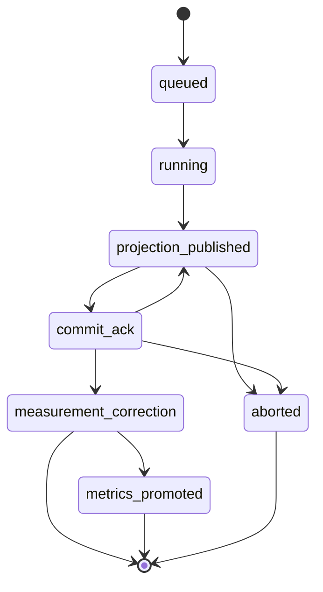

代码事实：

- geometry correction 会让同一个 transaction 再次 publish projection，因此 `commit_ack -> projection_published` 是真实路径。
- `projectionRefresh` 在 `measurement_correction` 后 finish，不进入 `metrics_promoted`。
- timeout、writer denied、commit token mismatch、missing data、detach、destroy 都会进入 `aborted`。
- segmentShift abort 会通知 input coordinator，安排下一帧清理 shift flags。

## 3. TransactionFlow 执行状态机

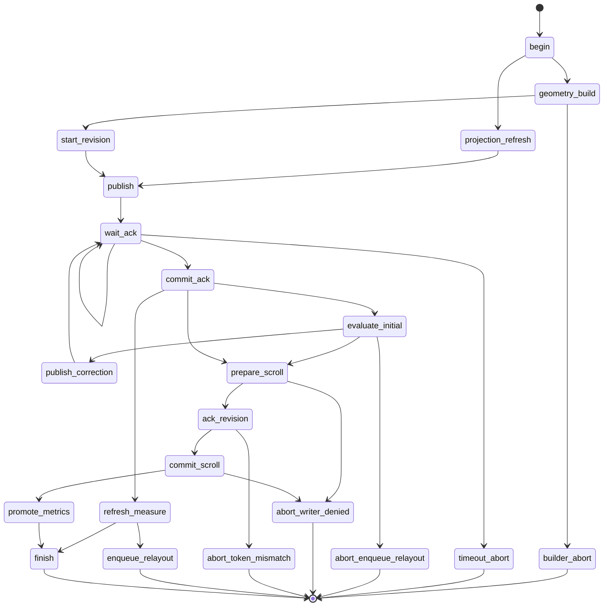

代码事实：

- `prepareTransactionScrollTop()` 在 revision ack 之前 acquire writer / prepare motion，但真正写入发生在 exact token ack 后的 `commit()`。
- `followBottom`、`jump`、`restore` 使用 `ScrollMotionEngine.prepare()`；当前 motion 是同步写入并立即 settle，不是分帧动画。
- `segmentShift` 使用 `segment-shift-rebase` writer。drag handoff source 会把 scrollTop rebase 到 safe range 内的中段位置。
- `bootstrap`、`segmentRelayout`、`reset` 等非 motion/non-shift 几何事务使用 `anchor-correction` writer。
- abort 恢复 transaction 开始前的 stable projection。

## 4. BootstrapState 已实现状态机

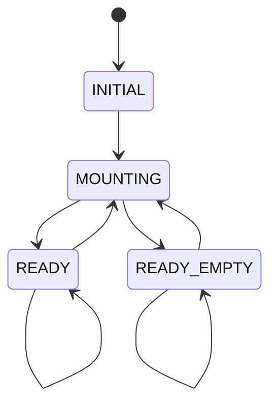

代码事实：

- publish bootstrap 时写 `MOUNTING`。
- bootstrap commit 后，items 非空写 `READY`，items 为空写 `READY_EMPTY`。
- 非 bootstrap transaction 保持当前 bootstrapState。
- `MEASURING`、`STABILIZING` 当前没有写入路径。

## 5. ViewportPhase 已实现状态机

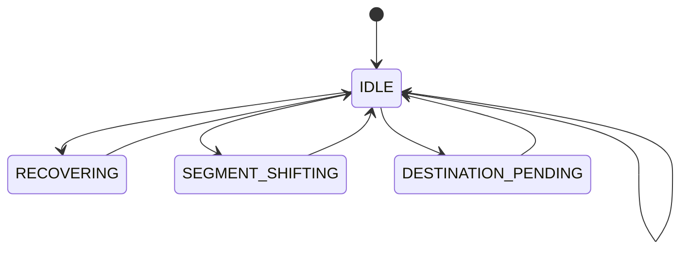

代码事实：

- `segmentShift` publish 写 `SEGMENT_SHIFTING`。
- `jump`、`restore` publish 写 `DESTINATION_PENDING`。
- `projectionRefresh` publish 保持 `IDLE`。
- 其他 transaction publish 写 `RECOVERING`。
- `promoteGeometry()` 最终写回 `IDLE`。
- P5 motion writer 不写 `MOTION_ACTIVE`；`MOTION_ACTIVE` 仍是 type-only。

## 6. BottomLockState 已实现状态机

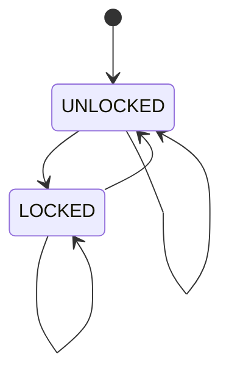

锁定来源：

- geometry promote：必须是 `followBottom` intent，并且 active segment role 是 `latest` 或 `short-feed`，`hasMoreAfter=false`，没有 segment shift pending/shifting，且距离 max scroll position 不超过 16px。
- scroll frame reconcile：active segment role 是 `latest` 或 `short-feed`，`hasMoreAfter=false`，没有 segment shift in-flight，且距离 max scroll position 不超过 16px。

解锁来源：

- 任意不满足上述条件的 geometry promote。
- scroll frame reconcile 发现离底、非 latest/short-feed、仍有 after 数据、或 segment shift in-flight。

当前边界：

- `bootstrap(latest)` 本身不是锁定来源。
- direct scroll 不直接写 bottomLockState；它写 scrollPosition，随后真实 scroll frame 才 reconcile。

## 7. Command 与 Pending Intent 状态机

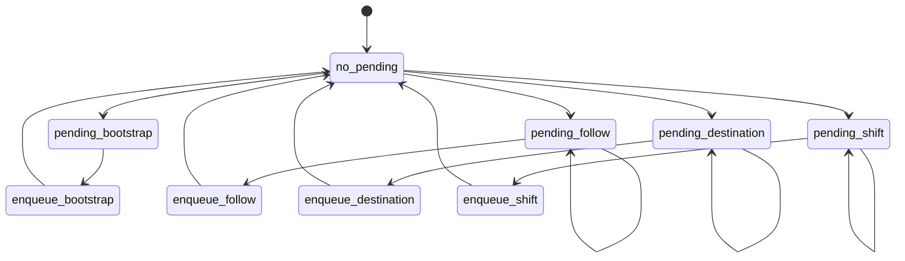

代码事实：

- `pendingBootstrap` 与 `pendingDataIntent` 是不同路径。
- `pendingBootstrap` 在下一次 `setDataSnapshot()` 中优先消费，直接 enqueue bootstrap，并跳过 classifier。
- `followBottom` 在 data 缺失或 `hasMoreAfter=true` 时变成 pending follow。
- `jump` / `restore` target 缺失时变成 pending destination。
- drag handoff、wheel boundary、segmentShift builder missing target data 都可能设置 pending segmentShift。
- data arrival classifier 会决定 pending intent 是否继续保留、重发 need event 或 enqueue transaction。

## 8. Data Arrival 决策图

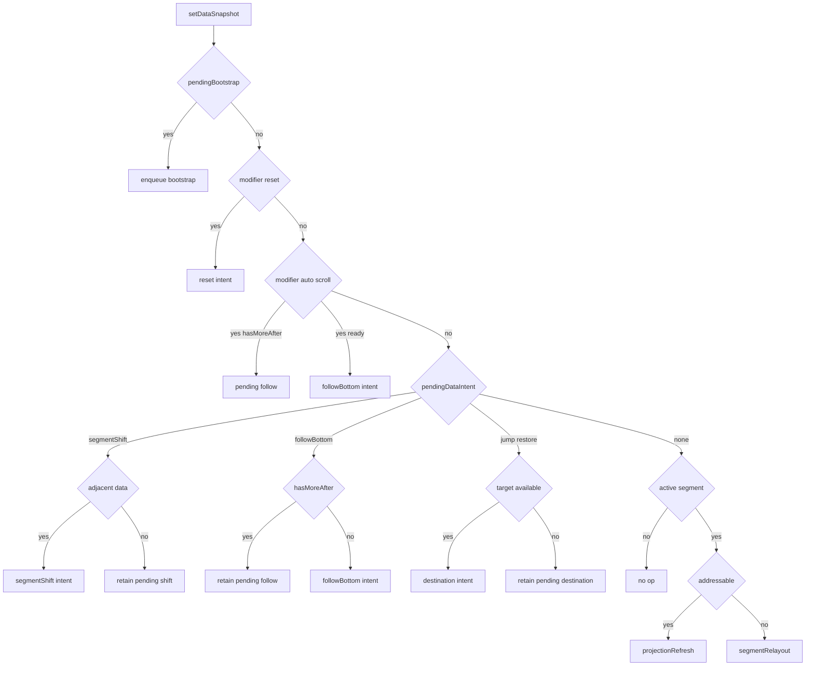

代码事实：

- `reset` 优先于 pending intent。
- `auto-scroll-to-bottom` 优先于 pending intent。
- `prepend` / `append` 不是 transaction kind。
- 每次 accepted data snapshot 后，input coordinator 会先同步 adjacent prefetch state，再处理 pending/classifier。

## 9. DOM Input Controller 状态机

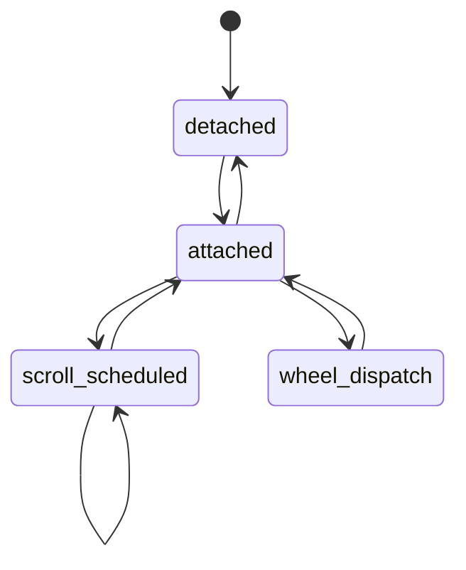

代码事实：

- attach 注册 `scroll` passive listener 和 `wheel` non-passive listener。
- scroll event 只记录 latest scrollTop；同一帧内只安排一次 rAF。
- rAF 回调调用 input coordinator 的 `onScrollFrame(scrollTop)`。
- wheel event 交给 boundary handler；handler 返回 true 时才 `preventDefault()`。
- detach 移除 listeners，并取消 pending rAF。

## 10. Scroll Frame 状态机

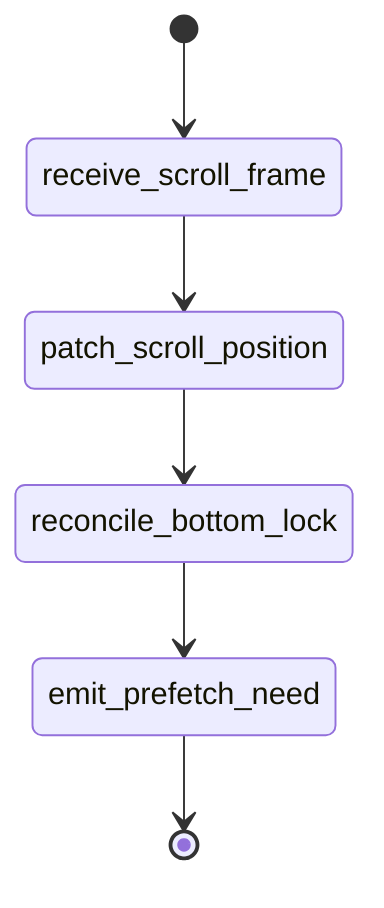

代码事实：

- scroll frame 更新 `#currentScrollTop`。
- physical metrics 只 patch `scrollPosition`，不会发布 projection。
- bottom lock 由真实 scroll metrics reconcile。
- adjacent prefetch need 由 edge latch 去重后发 `needMoreBefore` / `needMoreAfter`。

## 11. ResizeObserver / Relayout 状态机

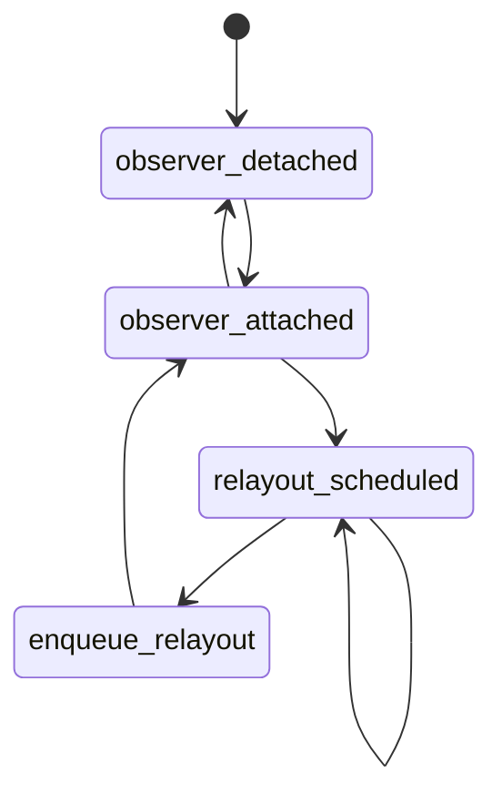

代码事实：

- container resize 安排 `segmentRelayout(reason='resize')`。
- row resize 安排 `segmentRelayout(reason='measurement')`。
- 同一 microtask 前只保留一个 pending resize/measurement reason。
- 没有 container、destroyed、或没有 committed segment 时不会 enqueue relayout。
- 当前代码没有写 `segmentRelayoutState: pending/running`。

## 12. ScrollInteractionState 状态机

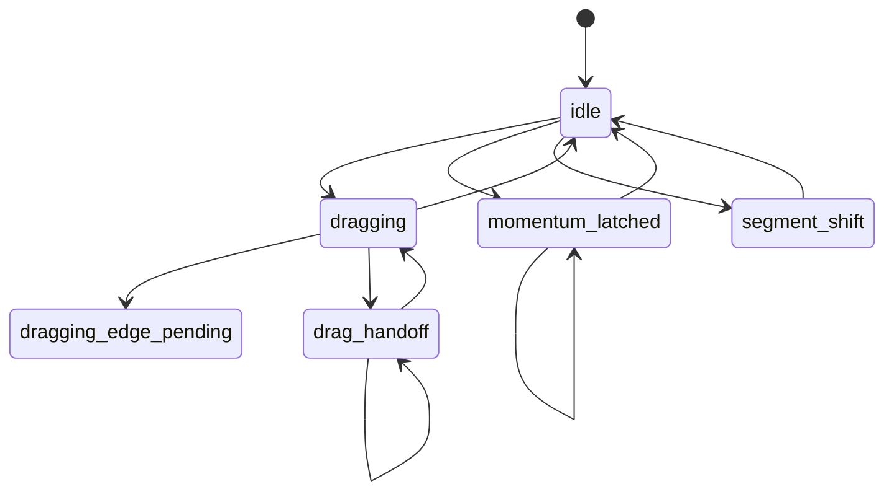

flag 对应关系：

- `dragging`：`isDragLocked=true`。
- `dragging_edge_pending`：`isDragLocked=true`，`isSegmentShiftPending=true`，`isThumbFrozen=false`。
- `drag_handoff`：`isDragLocked=true`，`isThumbFrozen=true`，`isSegmentShiftPending=true`，`isSegmentShifting=true`。
- `momentum_latched`：`isMomentumLatched=true`，`isSegmentShiftPending=true`，`suppressedMomentumDeltaPx>0`。
- `segment_shift`：`isSegmentShifting=true`，`isSegmentShiftPending=true`。

清理路径：

- `completeSegmentShift()` 清 thumb frozen、shift pending/shifting、momentum latch 和 suppressed delta。
- `abortSegmentShift()` 清同一组 flags。
- `endDrag()` 只清 `isDragLocked`。

## 13. Direct Scroll / Custom Scrollbar 状态机

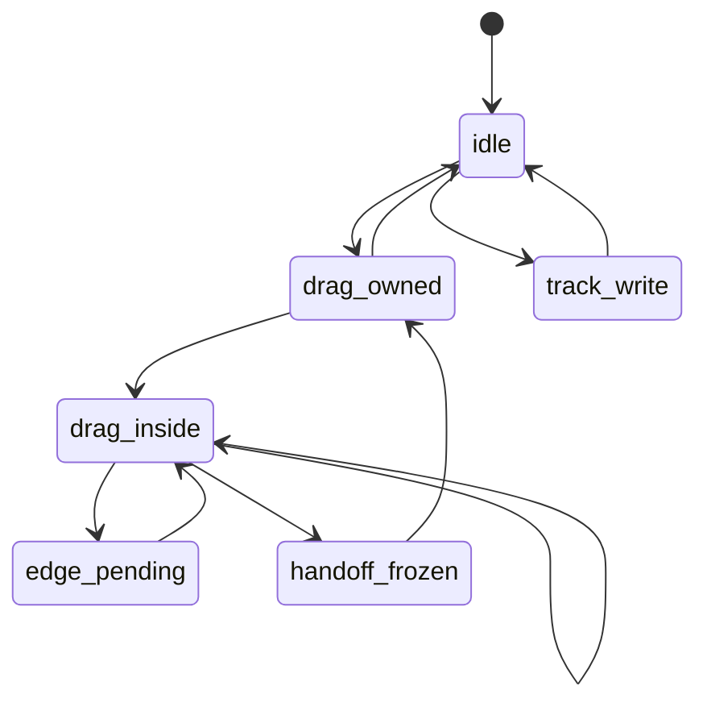

代码事实：

- thumb pointer down 调用 `beginDirectScroll(custom-scrollbar-drag)`，acquire `direct-drag` writer，设置 drag lock。
- drag write 在 safe range 内直接写 scrollTop，并 patch physical `scrollPosition`。
- drag write 越过 safe edge 且目标数据缺失：clamp 到 safe edge，设置 pending shift，发 need event，返回 true。
- drag write 越过 safe edge 且目标数据 ready：freeze thumb，释放 direct-drag writer，enqueue `segmentShift(source='drag-handoff')`，返回 false。
- segmentShift commit 后下一帧 `completeSegmentShift()` 解冻 thumb；如果 pointer 仍按住，会重新 acquire direct-drag writer。
- track click 是 one-shot acquire/write/release，不进入 drag lock。
- React custom scrollbar 在 `isThumbFrozen=true` 时复用上一份 visible geometry，并暂停 pointermove 写入。

## 14. Wheel / Momentum 状态机

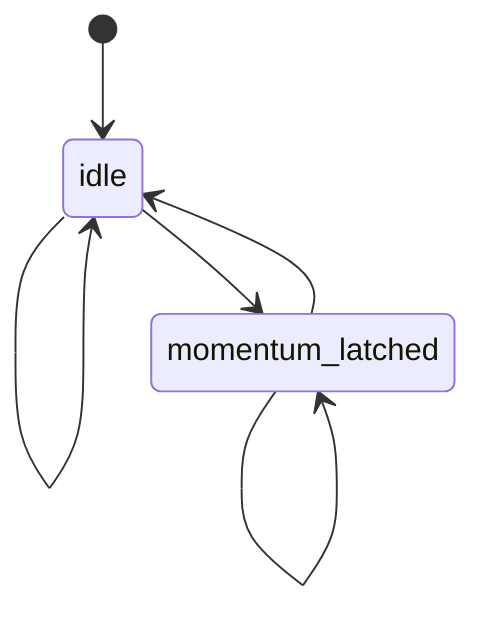

代码事实：

- 非 boundary wheel 不处理；如果已有 momentum latch 且回到 safe range，会释放 latch。
- boundary wheel 首次命中：latch momentum，累计 delta，设置 pending shift direction。
- 若相邻数据 ready，enqueue `segmentShift(source='wheel')`。
- 若相邻数据缺失，设置 pending segmentShift 并发 need event。
- 同方向 residual wheel 被 suppress，继续累计 `suppressedMomentumDeltaPx`，并 preventDefault。
- 反向 boundary delta 会释放 latch，并 preventDefault。
- wheel segmentShift commit/abort 后下一帧清 shift/momentum flags，并记录 release diagnostic。

## 15. Edge Need Latch / Adjacent Prefetch 状态机

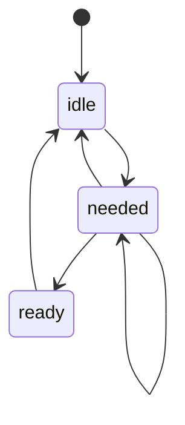

代码事实：

- `resolveEdgeNeedRequest()` 只在有 committed physical segment 且不在 `isSegmentShifting` 时工作。
- near edge threshold 是 `viewportSize * 1.5`。
- latch key 包含 feedId、generation、dataRevision、physicalSegmentId、physicalSegmentRevision、direction。
- 发 need 后 patch `adjacentPrefetchBefore/After='needed'`。
- data snapshot 到达后，如果相邻数据已可构建，patch 为 `ready`。
- 如果对应方向没有更多数据，patch 为 `idle`。
- 当前代码没有写 `in-flight`。

## 16. ScrollMotionEngine 状态机

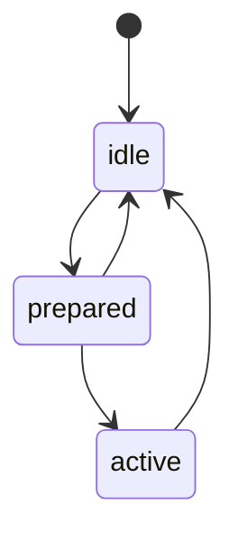

代码事实：

- `prepare()` 会先 cancel existing active motion。
- prepare 成功后 acquire `motion` writer，并记录 active token。
- `commit()` 记录 `motion.start`，写 scrollTop，成功后记录 `motion.settle`，随后 cancel with reason `settled` 并 release writer。
- prepare 后如果 caller cancel，则记录 `motion.cancel` 并 release writer。
- 当前 motion 不写 projection `viewportPhase=MOTION_ACTIVE`，也不是多帧动画。

## 17. PhysicalSegmentRevisionController 状态机

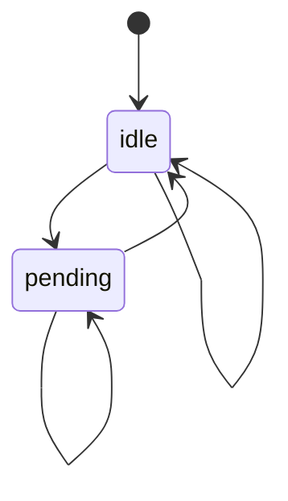

代码事实：

- `startPublication()` 从 idle 进入 pending，并在 projection publish 前分配 segmentRevision。
- correction 只 `replacePendingCommitToken()`，保持同一 segmentId/segmentRevision/transactionId。
- exact commit token ack 才 promote pending segment 为 committed。
- abort 清 pending，不复用已分配 revision。
- token mismatch 不改变 pending。

## 18. ScrollWriterArbitration 状态机

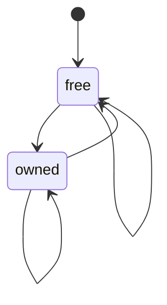

writer kind：

- `direct-drag`
- `direct-track`
- `anchor-correction`
- `segment-shift-rebase`
- `follow-bottom`
- `motion`

代码事实：

- free 或同 token 重入可以 acquire。
- 不同 token acquire 会被拒绝，不抢占。
- write 必须持有同 token。
- release、releaseTransaction、forceRelease 都可以回到 free。

## 19. React Projection / Adapter 状态机

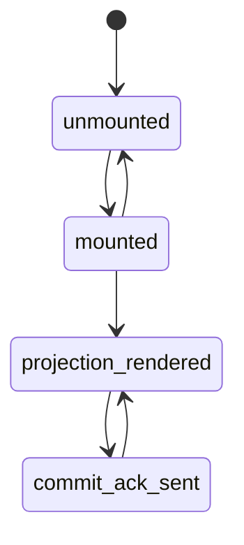

代码事实：

- `RuntimeNextMessageViewport` layout effect attach runtime，cleanup detach runtime。
- `useMessageViewportRuntime()` 订阅 projection snapshot，并在 layout effect 中回传完整 commit token。
- row projection 注册 row DOM refs；metrics 更新不触发 row tree subscription。
- `RuntimeNextCustomScrollbar` 单独订阅 physical metrics。
- native scrollbar 被 CSS 隐藏；custom scrollbar thumb geometry 只从 physical metrics 派生。

## 20. 当前未激活 / type-only 状态

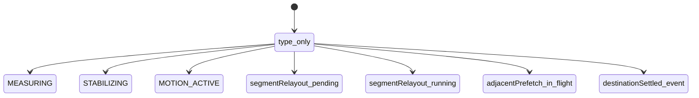

代码事实：

- `MEASURING`、`STABILIZING` 只在 `BootstrapState` 类型中存在。
- `MOTION_ACTIVE` 只在 `ViewportPhase` 类型中存在。
- `segmentRelayoutState` 目前初始化为 `idle`，derive/promote 默认也保持 `idle`；没有 pending/running 写入。
- `adjacentPrefetchBefore/After` 当前会写 `idle`、`needed`、`ready`；没有 `in-flight` 写入。
- `destinationSettled` 仍只有事件类型，没有发射点。
