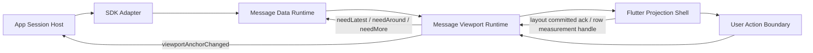

# Flutter Message Viewport Runtime Docs

本文档集面向 Flutter mobile v3.32.10 的消息滚动容器实现对齐。

它不是 XMessageList 当前原型代码的移植说明，也不是 Flutter widget 编写教程。
它只定义跨端必须一致的消息锚点、数据读取、视口运行时和投影层边界。

## 阅读顺序

1. [architecture/README.md](./architecture/README.md)
2. [architecture/message-anchor-mental-model.md](./architecture/message-anchor-mental-model.md)
3. [architecture/message-data-runtime-and-sdk-contract.md](./architecture/message-data-runtime-and-sdk-contract.md)
4. [architecture/message-runtime-layering-and-ownership.md](./architecture/message-runtime-layering-and-ownership.md)
5. [architecture/message-viewport-runtime-architecture.md](./architecture/message-viewport-runtime-architecture.md)
6. [viewport-runtime/README.md](./viewport-runtime/README.md)
7. [viewport-runtime/runtime-container-contract.md](./viewport-runtime/runtime-container-contract.md)
8. [viewport-runtime/projection-adapter-contract.md](./viewport-runtime/projection-adapter-contract.md)
9. [viewport-runtime/window-and-extent-algorithms.md](./viewport-runtime/window-and-extent-algorithms.md)
10. [viewport-runtime/transaction-and-scroll-timing.md](./viewport-runtime/transaction-and-scroll-timing.md)
11. [viewport-runtime/scroll-motion-and-animation.md](./viewport-runtime/scroll-motion-and-animation.md)
12. [viewport-runtime/lifecycle-and-testing.md](./viewport-runtime/lifecycle-and-testing.md)

## 核心结论

消息列表不应被建模为通用列表。它应该被建模为：

```text
message data runtime
-> message viewport runtime
-> platform projection shell
```



跨层定位使用 `MessageIdentityAnchor`。本地视口稳定使用 `AnchorState`。
追底状态使用 `BottomAnchor`。滚动 offset、列表 index、全局像素坐标都不能成为
持久恢复或跨层定位合同。

Flutter 端可以选择自己的 widget、sliver、controller 和 layout 实现方式，但必须
遵守这些边界：

- SDK 只负责返回 feed-scoped 消息数据，不感知视口测量。
- Data runtime 负责 latest / around 数据窗口与增量合并，不拥有滚动稳定。
- Viewport runtime 负责 materialized window、extent 估算、measurement、滚动语义、
  bottom lock 和 anchor stabilization。
- Projection shell 负责把 runtime snapshot 投影成可见 UI，并把 layout committed
  ack 与可测量 row handle 回传给 runtime。

## 非目标

本文档不规定：

- Flutter widget 树形态。
- 是否使用具体 sliver 组合。
- 业务消息 cell 的视觉样式。
- 图片、视频、富文本组件的内部实现。
- 本仓库现有原型代码的迁移步骤。
