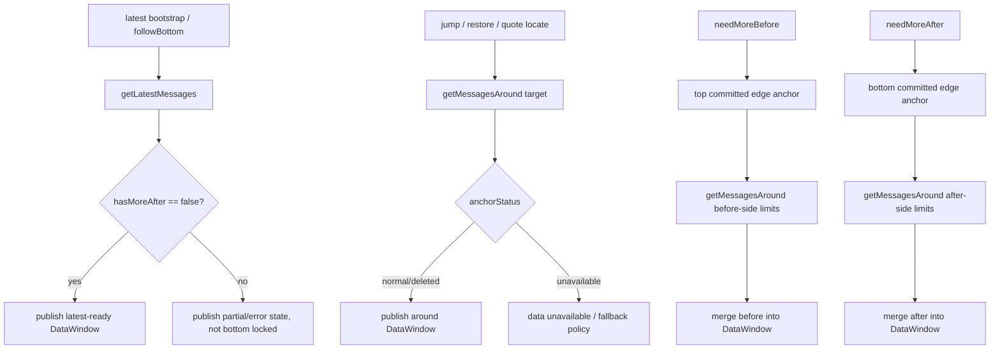

# Message Data Runtime 与 SDK 合同

## 1. Scope

本文定义 Flutter 端消息数据运行时如何使用 SDK，并向 viewport runtime 提供
view-agnostic 数据快照。

数据层不拥有：

- materialized window。
- before / after extent。
- row measurement。
- bottom lock。
- anchor stabilization。
- projection shell state。

## 2. SDK API

Flutter 端后续主要使用两个 SDK API：

```text
getLatestMessages(feedId, limit/context)
getMessagesAround(feedId, anchor, beforeLimit, afterLimit)
```

具体参数名可以由 SDK 决定，但稳定语义必须一致。本文后续的 latest、around、
before、after 都是 data runtime 的语义请求类型，不代表存在额外 SDK API。

### 2.1 getLatestMessages

用途：

- latest bootstrap。
- 显式 follow bottom。
- 自己发送消息后需要回到 latest bottom。
- 当前 DataWindow 是 partial window 且 `hasMoreAfter == true` 时，直接重建 latest
  window。

返回必须表达：

- feedId。
- ordered messages。
- latest anchor。
- anchorStatus。
- hasMoreBefore。
- hasMoreAfter。

`getLatestMessages` 不是普通 append。它代表直接读取 feed 最新位置附近的数据窗口。
可用于 latest bootstrap / followBottom 的 latest result 必须确认
`hasMoreAfter == false`。如果 SDK 返回无法确认 latest bottom 的响应，data runtime
不得把它发布为 latest-ready snapshot，只能作为普通 partial window 或错误处理。

### 2.2 getMessagesAround

用途：

- unread bootstrap。
- restored position。
- jump to message。
- quote locate。
- search locate。
- missing anchor fallback。

输入 anchor 使用 `MessageIdentityAnchor`。输出必须围绕实际命中的 anchor 返回有序
消息窗口，并显式表达 `anchorStatus`。

如果目标消息 deleted 或因 retention 不可投影，SDK adapter / data runtime 必须选择
nearest neighbor 或返回 `unavailable`，不能让 viewport runtime 猜测服务端语义。

## 3. Data Runtime 职责

Data Runtime 只回答三个问题：

1. 以哪个 `MessageIdentityAnchor` 或 latest 语义读取。
2. 当前 feed 已知哪些有序 message runtime items。
3. 当前数据边界是否还能继续扩展。

Data Runtime 负责：

- Feed cache。
- Ordered merge。
- DataWindow。
- latest / around request orchestration。
- before / after pagination。
- incremental subscription merge。
- optimistic rebind。
- request cancellation and stale response discard。
- stable snapshot publish。

Data Runtime 不负责：

- 计算 materialized rows。
- 估算 before / after extent。
- 读取 row size。
- 修正滚动 offset。
- 捕获 `AnchorState`。

## 4. Bridge Result Shape

推荐稳定结果：

```text
MessageWindowResult {
  feedId
  requestKind: latest | around | edgeBefore | edgeAfter
  requestedAnchor?
  resolvedAnchor?
  anchorStatus: normal | deleted | unavailable
  items
  hasMoreBefore
  hasMoreAfter
  revision
}
```

`requestKind` 是 data runtime 内部语义，不是 SDK 方法名。`before` / `after`
分页仍然可以由 `getMessagesAround(edgeAnchor, beforeLimit, afterLimit)` 承接。

禁止在该结果中包含：

- viewport offset。
- before / after extent。
- measured row height。
- materialized range。
- projection shell state。

## 5. MessageDataSnapshot

Data Runtime 输出给 viewport runtime 的快照：

```text
MessageDataSnapshot {
  feedId
  generation
  revision
  items
  anchor?
  anchorStatus?
  hasMoreBefore
  hasMoreAfter
  change
}

MessageDataSnapshotChange {
  kind: initial | append | prepend | patch | delete | identityRebind | reset
  viewportEffect:
    none
    possibleHeightChange
    identityRemap
    anchorRisk
    fullReset
}
```

`revision` 表达 data snapshot identity 已变化，不代表 viewport 必须滚动。
Viewport runtime 必须同时读取 `change.viewportEffect`。

## 6. Entry Protocols

### Latest

```text
getLatestMessages
-> publish DataWindow with hasMoreAfter == false
-> viewport runtime performs latest bootstrap
```

Data Runtime 不执行 scroll to bottom。

### Unread

```text
resolve unread MessageIdentityAnchor
-> getMessagesAround(unread)
-> publish DataWindow
-> viewport runtime positions unread context
```

Unread marker 是 projection 语义，bootstrap timing 属于 viewport runtime。

### Restored

```text
load persisted identity part
-> getMessagesAround(restored identity)
-> allow nearest-neighbor fallback
-> publish DataWindow with anchorStatus
-> viewport runtime restores local offset after layout
```

### Jump / Quote Locate

```text
target MessageIdentityAnchor
-> getMessagesAround(target)
-> replace or stage DataWindow
-> viewport runtime performs destination transaction
```

远距离 jump 不是连续浏览，不能通过 before / after pagination 顺序补齐中间空洞。

如果 `anchorStatus == unavailable`，data runtime 不发布普通 destination-ready
snapshot。它必须发布 data error / unavailable state，或按 app policy 回退到 latest
bootstrap。Viewport runtime 不得对 unavailable target 执行 nearest measurable row
fallback，因为数据层已经声明没有可恢复的语义邻居。

### Before / After Pagination

用户自然浏览到 DataWindow 边缘时，可以用 edge anchor 执行 before / after
分页，并 merge 到当前 DataWindow。

这类分页仍使用 `getMessagesAround`：

```text
needMoreBefore
-> top committed edge anchor
-> getMessagesAround(edgeAnchor, beforeLimit > 0, afterLimit = 0 or small context)
-> merge before side into DataWindow

needMoreAfter
-> bottom committed edge anchor
-> getMessagesAround(edgeAnchor, beforeLimit = 0 or small context, afterLimit > 0)
-> merge after side into DataWindow
```

但显式 follow bottom 和显式 jump / restore 不走 edge pagination。

## 7. Invariants

Data Runtime 必须保证：

- feed scoped。
- stable ordering。
- item identity 去重。
- append / prepend merge 幂等。
- optimistic rebind 原子化。
- anchorStatus 显式。
- partial response 可表达。
- request failure 可重试。
- stale generation response 被丢弃。

Data Runtime 不保证：

- 全量消息存在。
- 所有 row 高度已知。
- index 永久稳定。
- anchor message 永远可投影。

## 8. Runtime Event 到 SDK 的映射

Viewport runtime 只能发语义事件：

| Event | Data Runtime action |
| --- | --- |
| `needLatestMessages(reason: bottomFollow)` | call `getLatestMessages` |
| `needMessagesAround(reason: jump/restore, target)` | call `getMessagesAround` |
| `needMoreBefore(reason: nearTop)` | call `getMessagesAround` from top committed edge with before-side limits |
| `needMoreAfter(reason: nearBottom)` | call `getMessagesAround` from bottom committed edge with after-side limits |

SDK query 参数由 data runtime 决定，viewport runtime 不携带 SDK 细节。

## 9. SDK Flow


