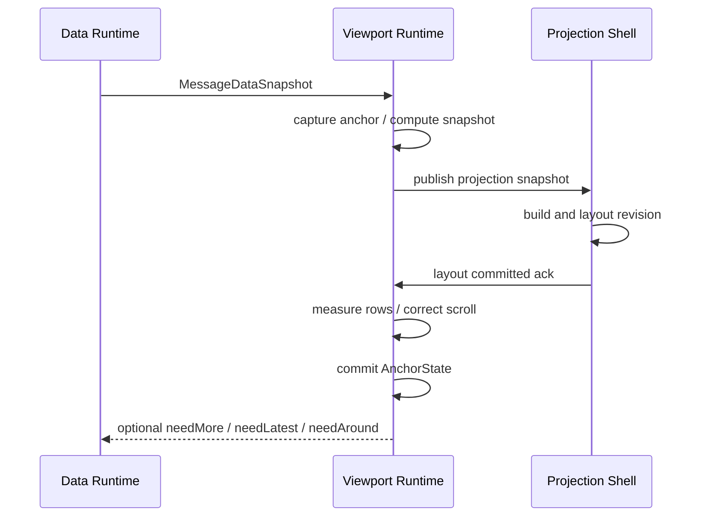

# Message Viewport Runtime 架构白皮书

## 1. Scope

本文定义 Flutter 移动端 IM 消息滚动容器的跨端架构原则。

目标场景：

- 动态高度消息。
- 双向历史加载。
- latest bootstrap。
- unread / restored / jump / quote locate。
- 图片、视频、富文本等异步高度变化。
- feed switching 和本地会话恢复。

本文不讨论：

- 通用列表组件。
- 具体 widget / sliver 组合。
- 业务消息 cell 视觉样式。
- 极限 item 数量优化。

核心目标：

1. Viewport stability。
2. Deterministic scroll behavior。
3. Dynamic height stability。
4. Prepend continuity。
5. Async media stability。

## 2. System Model

系统本质不是普通 virtual list，而是：

```text
Deterministic Message Viewport Runtime
```

Runtime 维护的是用户正在观察的消息视口，而不是整个消息集合的全局几何布局。

因此，设计优先级不是最少 materialized rows，而是：

- 当前可见内容不漂移。
- 语义命令有确定结果。
- 高度变化可被稳定吸收。
- 数据窗口可局部重建。

## 3. Anchor-first Scroll Model

滚动 offset 不是权威状态。

权威状态是：

```text
AnchorState {
  key
  offsetWithinItem
}
```

它表达当前视口顶部所在的 runtime item 和局部偏移。

`AnchorState` 支撑：

- prepend recovery。
- resize stabilization。
- trim continuity。
- restored session position。
- jump settle 后的持久化。

业务层不得把 offset、index 或全局像素位置作为恢复合同。

## 4. Runtime-owned Scroll Semantics

业务层和 projection shell 不直接写滚动位置。

Runtime 对外只暴露语义命令：

```text
bootstrap(latest/unread/restored)
jump(target)
restore(anchor)
followBottom
reset(reason)
```

原因是滚动位置只是当前 projection、layout、content extent 和 viewport extent 的物理结果。
业务语义必须先进入 runtime transaction，再由 runtime 决定如何改变 projection 和滚动。

## 5. MaterializedWindow

Viewport runtime 维护：

```text
MaterializedWindow {
  startIndex
  endIndex
  itemKeys
}
```

其中 index 只是当前 `MessageDataSnapshot.items` 内的临时派生值。

禁止把 index 用于：

- restore 坐标。
- SDK request。
- persistent anchor。
- cache identity。

MaterializedWindow 可以小于 DataWindow。DataWindow 用于数据可用性和 merge，
MaterializedWindow 用于当前需要投影和测量的 row 范围。

## 6. Extent Strategy

Runtime 使用：

```text
beforeExtent
afterExtent
```

维持滚动连续性。

它们是未 materialized item 的估算占位，不是全局精确坐标系统。

允许：

- estimated item height。
- rolling average。
- local correction。
- partial inaccuracy。

禁止：

- 要求全量 item 精确测量后才能跳转。
- 用全局 cumulative offsets 作为架构基础。

## 7. Local Measurement

Measurement 必须局部化，只覆盖 materialized window 及其附近需要稳定的 row。

Measurement 是观察行为，不是布局驱动行为：

```text
layout committed
-> observe row sizes
-> update height cache
-> stabilize anchor or bottom
```

Runtime 不应主动计算整条消息流的布局。

Height cache 可用于：

- extent estimation。
- trim continuity。
- jump initialization。
- identity rebind。

但 height cache 不是永久布局数据库，必须随 feed reset、width bucket、density、font、
theme、content version 和 identity rebind 失效。

## 8. Bottom Lock

Bottom lock 是独立状态。

```text
BottomLockState = LOCKED | UNLOCKED | RECOVERING
```

LOCKED 表示用户正在跟随 feed latest bottom。它必须满足：

```text
hasMoreAfter == false
distanceToBottom <= lockThreshold
```

如果 `hasMoreAfter == true`，当前底部不是 feed latest bottom，不能进入 LOCKED。

推荐使用双阈值：

```text
distance <= lockThreshold -> LOCKED
distance > unlockThreshold -> UNLOCKED
middle -> keep previous state
```

## 9. Transaction

所有改变 MaterializedWindow、extent，或需要提交后校正滚动位置的操作，都必须进入
viewport transaction。

核心时序：

```text
capture pre-state
-> compute next projection snapshot
-> publish snapshot
-> wait layout committed ack
-> measure required rows
-> correct scroll position if needed
-> update height cache / extent
-> commit anchor state
-> release transaction
```

如果没有 layout committed ack 就测量和修正，runtime 会读到旧投影结果。



## 10. Dynamic Height Stabilization

普通 anchored 模式：

```text
height change above anchor -> offset += delta
height change below anchor -> no correction
```

Bottom locked 模式：

```text
bottom-affecting height change -> keep latest bottom visible
```

这两个模式不能合并。Bottom lock 是 anchored stabilization 的例外状态。

高度变化必须按 frame 合并处理，避免微小抖动和重复校正。

## 11. Destination Jump

Jump、quote locate、search locate 都是 destination intent，不是连续浏览。

如果目标不在当前 DataWindow：

```text
runtime emits needMessagesAround(target)
-> data runtime calls getMessagesAround
-> replace/stage DataWindow
-> runtime performs destination transaction
```

不能沿当前窗口逐页 before / after 补齐到目标。

## 12. Final Summary

这套架构的关键不是“如何写一个列表”，而是：

```text
用消息身份锚点承接跨层定位，
用 viewport runtime 承接本地滚动稳定，
用 projection shell 承接 Flutter 视觉表达。
```
