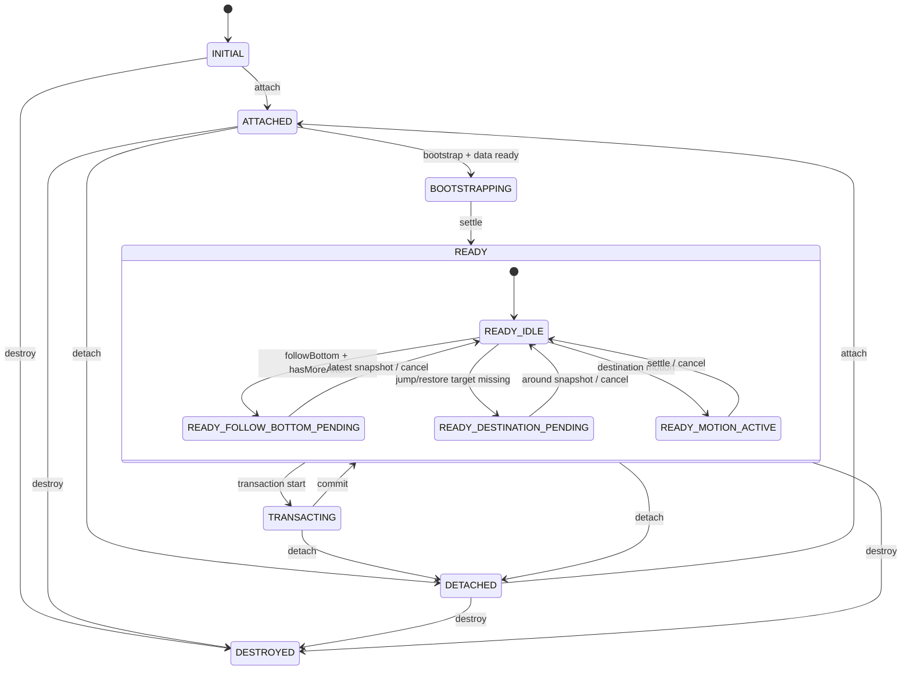

# Runtime 容器合同

## 1. Scope

本文定义 Flutter viewport runtime 的公开 surface、内部模块边界、状态机和事件合同。

## 2. Runtime Shape

推荐核心对象：

```text
MessageViewportRuntime
  attach(host)
  detach()
  destroy()

  setDataSnapshot(snapshot)
  dispatch(command)

  subscribe(listener)
  subscribeEvent(listener)
  getSnapshot()
  getViewportAnchorState()

  registerRow(key, measurementHandle?)
  registerBeforeExtent(handle?)
  registerAfterExtent(handle?)
  notifyProjectionCommitted(commit)
```

`host`、`measurementHandle` 的具体类型由 Flutter 实现决定。合同只要求它们能支持：

- 读取 viewport extent。
- 读取 content extent。
- 读取当前 scroll offset。
- 命令式写入 scroll offset。
- 获取 materialized row 在 viewport 坐标系下的位置与大小。

Runtime 必须：

- 脱离具体业务 message cell。
- 命令式。
- 可销毁。
- feed scoped。
- generation scoped。

## 3. Snapshot Boundary

Runtime 发布给 projection shell 的是 projection snapshot，不是 internal state。

```text
MessageViewportSnapshot {
  feedId
  generation
  revision
  items
  materializedWindow
  beforeExtent
  afterExtent
  bottomLockState
  bootstrapState
  edgeState
}
```

必须进入 snapshot：

- `items`。
- `materializedWindow`。
- `beforeExtent`。
- `afterExtent`。
- `bottomLockState`。
- `bootstrapState`。
- edge loading / exhausted 状态。

禁止进入 snapshot：

- 当前滚动 offset。
- measured row rects。
- internal transaction object。
- command queue。
- height cache map。
- raw gesture details。

规则：

```text
会改变 projection 要渲染什么，才进入 snapshot。
只影响 runtime 如何稳定视口，不进入 snapshot。
```

## 4. Internal Modules

| Module | Responsibility | Projection visible |
| --- | --- | --- |
| Runtime facade | 稳定 public API | yes |
| Controller | 组合 runtime parts、路由 command 和 data effect | no |
| ProjectionStore | 保存并发布 snapshot | through getSnapshot |
| CommitCoordinator | 等待 projection/layout committed ack | no |
| RowRegistry | host、row、extent handles | no |
| AnchorCoordinator | 捕获 anchor、解析 restore target、选择 measurable row | no |
| WindowEngine | 计算 MaterializedWindow | through snapshot |
| ExtentEngine | 估算 before / after extent | through snapshot |
| MeasurementEngine | row measurement、height cache | no |
| ScrollIntentEngine | 区分 user / runtime / recovery / follow bottom / jump | bottomLockState only |
| MotionEngine | 目的地滚动动画、取消和 settle | no |
| TransactionRunner | 串行化 transaction queue | no |
| EdgeNeedCoordinator | needMore / needLatest / needAround 事件 | no |
| LifecycleGuard | generation、destroy、detach、异步资源清理 | no |

## 5. Runtime State Machine

```text
RuntimeState =
  INITIAL
  ATTACHED
  BOOTSTRAPPING
  READY
  TRANSACTING
  DETACHED
  DESTROYED
```

转移规则：

| From | Event | To |
| --- | --- | --- |
| INITIAL | attach | ATTACHED |
| ATTACHED | bootstrap command + data ready | BOOTSTRAPPING |
| BOOTSTRAPPING | settle | READY |
| READY | transaction start | TRANSACTING |
| TRANSACTING | transaction commit | READY |
| ATTACHED / READY / TRANSACTING | detach | DETACHED |
| DETACHED | attach | ATTACHED |
| any non-destroyed | destroy | DESTROYED |

`detach` 不等同于 `destroy`。Feed 切走但 runtime 仍被 cache 保留时，应 detach。
只有 LRU 淘汰、显式关闭会话或页面最终销毁时才 destroy。

READY 可以有 runtime 私有子状态：

```text
READY_IDLE
READY_FOLLOW_BOTTOM_PENDING
READY_DESTINATION_PENDING
READY_MOTION_ACTIVE
```

这些子状态不进入 public snapshot。

## 6. Public Events

Runtime 可以发出 view-level 事件：

```text
needMoreBefore(feedId, generation, reason: nearTop | prependRecovery)
needMoreAfter(feedId, generation, reason: nearBottom)
needLatestMessages(feedId, generation, reason: bottomFollow)
needMessagesAround(feedId, generation, reason: jump | restore, target)
viewportAnchorChanged(feedId, generation, reason: scrollIdle | transactionSettle | detach, anchor?)
viewportReady(feedId, generation)
viewportError(feedId, generation, code)
```

事件只能表达 viewport 需求，不携带 SDK query 细节。

规则：

- `needMoreBefore` / `needMoreAfter` 只在 READY、READY_IDLE、scroll source 是 user
  或 momentum 时发出。
- bootstrap、commit timeout recovery、pending follow bottom、pending destination、
  active motion 期间不得发 edge paging event。
- 显式 follow bottom 且 `hasMoreAfter == true` 时，只发 `needLatestMessages`。
- 显式 jump / restore 目标不在 DataWindow 时，只发 `needMessagesAround`。
- Projection shell 不得用 raw scroll metrics 自行重建分页判断。

## 7. Command Queue

```text
MessageRuntimeCommand =
  bootstrap(mode: latest | unread | restored, target?)
  jump(target)
  restore(target)
  followBottom
  reset(reason)
```

规则：

- 命令串行执行。
- later jump supersedes earlier pending jump。
- reset cancels all pending commands。
- generation change cancels all old commands。
- destroyed state rejects all commands。
- detached state only accepts bootstrap / reset if host policy allows it。

`restore(target)` 的 target 如果是 `AnchorState`，必须来自同一个 runtime generation。
如果只剩 persisted identity anchor，runtime 应等待 data runtime 发布 around snapshot
后再执行 restore transaction。

## 8. Runtime State Diagram


