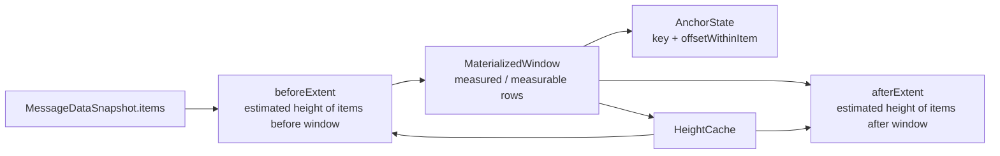

# MaterializedWindow 与 Extent 算法

## 1. Scope

本文定义 viewport runtime 内部的 window 滑动、trim 和 extent 估算策略。

目标不是精确全局 offset，而是在 IM 场景下维持稳定可感知视口。

## 2. Terms

```text
MaterializedWindow {
  startIndex
  endIndex
  itemKeys
}

WindowConfig {
  minOverscanExtent
  maxOverscanExtent
  minMaterializedItems
  maxMaterializedItems
  defaultItemExtent
}
```

这些配置约束的是 runtime row unit，不承诺等于业务 message 条数。如果后续引入 date
divider、unread divider、sender grouping，也应以 runtime row unit 作为 window、
trim 和 anchor 的稳定单位。

## 3. Window Sliding Trigger

Runtime 使用 scroll metrics 与 edge signal。

scroll metrics 是权威触发，edge signal 只能预热数据读取或提示 runtime 检查边缘。

触发条件应基于：

```text
distanceToBeforeEdge
distanceToAfterEdge
minOverscanExtent
```

edge signal 不能直接修改 MaterializedWindow。Window 修改必须进入 transaction。

## 4. Window Recompute

Window 以当前 viewport anchor 为中心重算。

```text
computeWindowAroundAnchor(
  items,
  anchorIndex,
  viewportExtent,
  heightCache,
  config
)
```

规则：

- latest bootstrap、followBottom、bottom locked append 以 latest item 或 bottom anchor
  为局部 anchor，使用 viewport-aware window 计算。
- 如果暂时拿不到有效 viewport extent，latest window 可以退回到尾部
  `minMaterializedItems` 的保守 fallback。
- `anchorIndex` 只是当前 data snapshot 内的派生值。
- 持久恢复和跨层定位不能使用 index。
- 当前 anchor 不存在时，先使用 nearest visible item，再必要时 reset bootstrap。
- anchor 靠近数据边界且 window 低于最小条数时，缺少 quota 尽量向有数据的一侧补齐。

## 5. Trim Order

Trim 必须与 extent 更新在同一个 projection revision 中提交。

正确顺序：

```text
capture anchor
-> compute next window
-> compute before/after extent delta
-> publish snapshot(items slice + extents)
-> wait layout committed ack
-> measure
-> correct scroll offset if needed
```

禁止：

```text
remove rows
-> next frame
-> increase before/after extent
```

否则 content extent 会短暂收缩，用户可见内容会漂移。

## 6. Height Cache

```text
HeightRecord {
  extent
  measuredAtRevision
  contentVersion
  widthBucket
}
```

Cache key 使用 `MessageRuntimeItemKey`。

失效条件：

- feed generation 变化。
- viewport width bucket 变化。
- message content version 变化。
- density / font / theme 影响布局。
- optimistic rebind 后内容不等价。

Cache 回收应优先删除已经不在当前 data snapshot 的 key，再删除远离当前 viewport 的 key。

## 7. Extent Estimation

单条估算：

```text
estimateItemExtent(key) =
  heightCache[key]
  or localAverageByKind
  or feedRollingAverage
  or defaultItemExtent
```

范围估算：

```text
beforeExtent = estimateRange(items, 0, window.startIndex)
afterExtent = estimateRange(items, window.endIndex + 1, items.length)
```

Extent 必须 clamp 到 `>= 0`。

## 7.1 Window / Extent Relationship



## 8. Prepend Correction

Prepend 前：

```text
capture anchor item viewport top
capture old beforeExtent
```

Prepend projection：

```text
new items inserted
new beforeExtent estimated
```

Layout committed 后：

```text
newAnchorTop = measureAnchorTop(anchorKey)
delta = newAnchorTop - oldAnchorTop
scrollOffset += delta
```

随后更新 prepended rows 的 height cache。当前帧的视觉稳定主要依赖 anchor rect
correction，不依赖全局 extent 精确。

## 9. Append Correction

Append 在 unlocked 状态下不自动追底。

Append 在 locked 状态下：

```text
publish appended projection
-> wait layout committed ack
-> measure new rows
-> keep latest bottom visible
```

Append 不应该因为新消息到达而抢走用户向上阅读的位置。

## 10. Bottom Distance

Bottom distance 应基于当前平台 scroll metrics 计算：

```text
distanceToBottom = max(0, contentExtent - scrollOffset - viewportExtent)
```

使用双阈值：

```text
distance <= lockThreshold -> LOCKED
distance > unlockThreshold -> UNLOCKED
middle -> keep previous state
```

Bottom edge signal 可以辅助校验，但不能作为唯一 truth。

## 11. Identity Rebind

收到 `identityRemap`：

```text
pause window sliding
-> migrate height cache key
-> migrate row registry key if row is still materialized
-> migrate anchor key if anchor points to optimistic item
-> publish snapshot with committed key
-> wait layout committed ack
-> verify anchor measurement
```

如果 projection 必然 remount row，runtime 必须用 commit 后 correction 保持视觉位置。

## 12. Empty And Edge States

`items.length == 0` 时：

- `beforeExtent = 0`。
- `afterExtent = 0`。
- no row measurement。
- bootstrap 可以进入 `READY_EMPTY`。

推荐 edge state：

```text
ViewportEdgeState {
  before: idle | loading | exhausted | error
  after: idle | loading | exhausted | error
}
```

Edge indicator 是 projection item 或 extent 邻接 UI，但不参与 message height cache。
