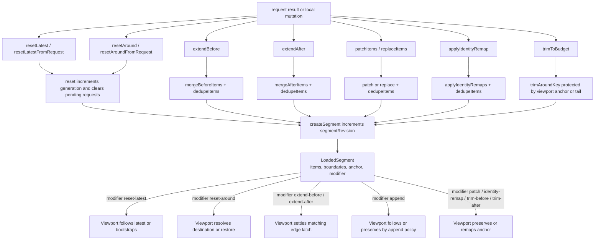

# Data Runtime

## Request Token Lifecycle

```mermaid
stateDiagram-v2
  [*] --> NoCurrent
  NoCurrent: no current requestToken for kind
  CurrentPending: current requestToken, generation, kind
  SupersededPending: older token still stored but no longer current
  ConsumedApplied: matching current token consumed
  StaleRejected: missing, wrong kind, wrong generation, or no longer current

  NoCurrent --> CurrentPending: createRequestToken(kind)
  NoCurrent --> CurrentPending: adoptRequestToken(same generation)
  CurrentPending --> SupersededPending: create or adopt newer token for same kind
  CurrentPending --> ConsumedApplied: consumeRequest matches token, kind, generation, current by kind
  SupersededPending --> StaleRejected: consume older replaced token
  CurrentPending --> StaleRejected: consume wrong kind, wrong generation, or missing token
  ConsumedApplied --> NoCurrent: current pointer cleared; create LoadedSegment
  StaleRejected --> NoCurrent: rejected token was only current token
  StaleRejected --> CurrentPending: newer current token remains
  CurrentPending --> NoCurrent: reset increments generation and clears pending requests
  SupersededPending --> NoCurrent: reset increments generation and clears pending requests
```

Stale consume 只删除被消费的 token；如果 stale 原因是 older replaced token，新的 current token 仍保留。`around` adoption 会清掉 current `latest`；`latest` adoption 会清掉 current `around`。这让 destination 和 follow-latest 在 data-runtime token 层互斥。

## Segment Modifier Creation

