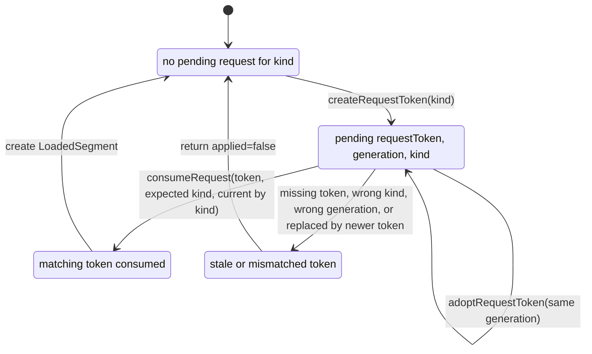
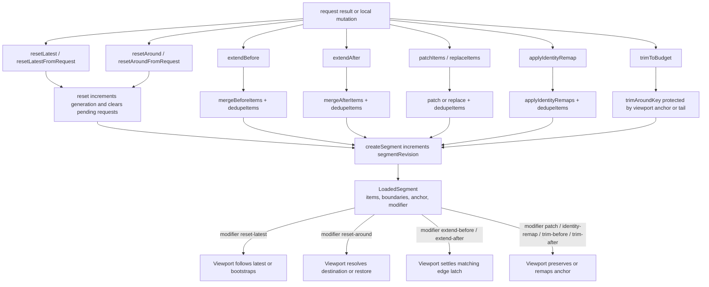

# Data Runtime

## Request Token Lifecycle

`around` adoption 会清掉 current `latest`；`latest` adoption 会清掉 current `around`。这让 destination 和 follow-latest 在 data-runtime token 层互斥。

## Segment Modifier Creation

