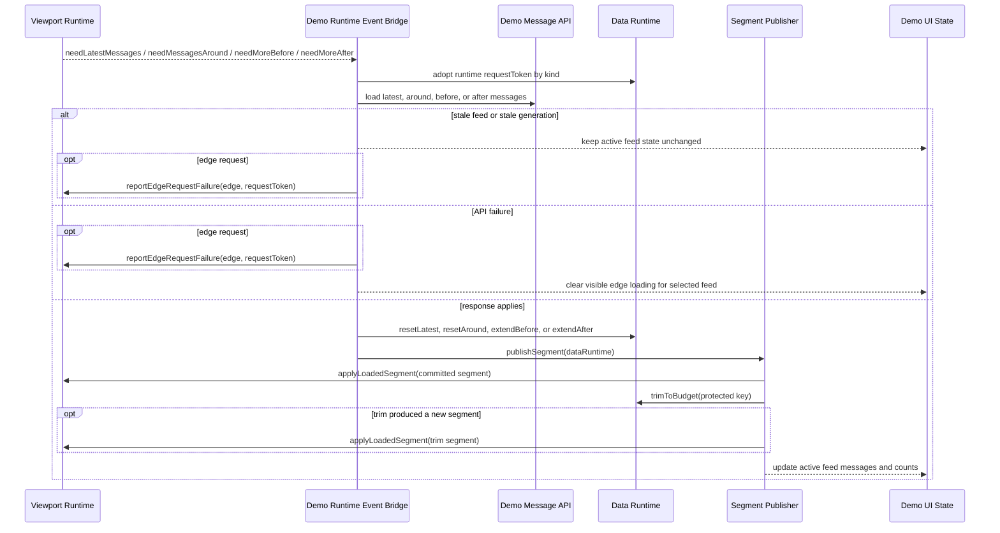
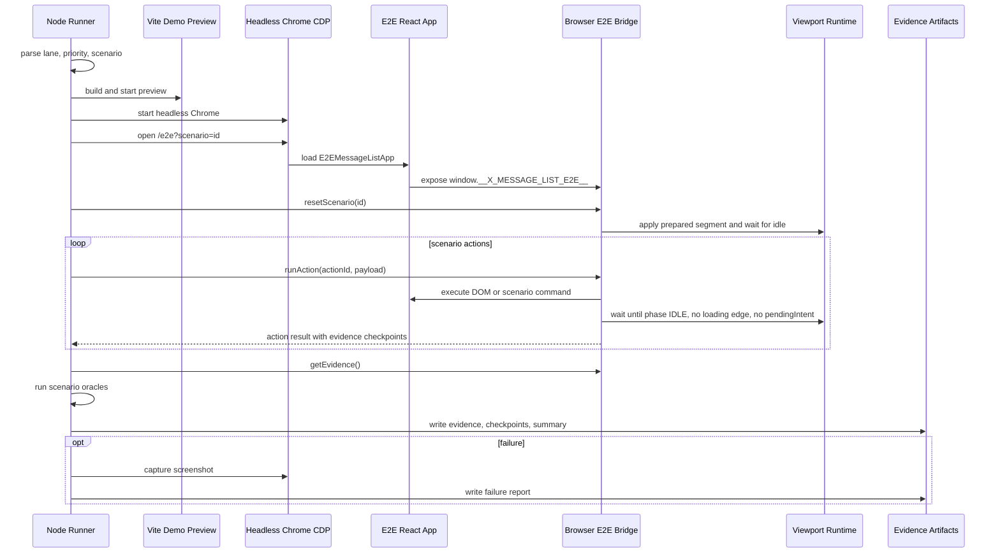

# Demo And E2E

## Demo Semantic Event Bridge

```mermaid
sequenceDiagram
  participant Runtime as Viewport Runtime
  participant Bridge as Demo Runtime Event Bridge
  participant API as Demo Message API
  participant Data as Data Runtime
  participant Publisher as Segment Publisher
  participant UI as Demo UI State

  Runtime-->>Bridge: needLatestMessages / needMessagesAround / needMoreBefore / needMoreAfter
  Bridge->>Data: adopt runtime requestToken by kind
  Bridge->>API: load latest, around, before, or after messages

  alt stale feed or stale generation
    Bridge-->>UI: keep active feed state unchanged
    opt edge request
      Bridge->>Runtime: reportEdgeRequestFailure(edge, requestToken)
    end
  else API failure
    opt edge request
      Bridge->>Runtime: reportEdgeRequestFailure(edge, requestToken)
    end
    Bridge-->>UI: clear visible edge loading for selected feed
  else response applies
    Bridge->>Data: resetLatest, resetAround, extendBefore, or extendAfter
    Bridge->>Publisher: publishSegment(dataRuntime)
    Publisher->>Runtime: applyLoadedSegment(committed segment)
    Publisher->>Data: trimToBudget(protected key)
    opt trim produced a new segment
      Publisher->>Runtime: applyLoadedSegment(trim segment)
    end
    Publisher-->>UI: update active feed messages and counts
  end
```

Demo host 响应 runtime semantic events；它不读取 projection DOM 来补救 scroll 行为。

## E2E Harness

```mermaid
sequenceDiagram
  participant Runner as Node Runner
  participant Preview as Vite Demo Preview
  participant Chrome as Headless Chrome CDP
  participant App as E2E React App
  participant Bridge as Browser E2E Bridge
  participant Runtime as Viewport Runtime
  participant Artifacts as Evidence Artifacts

  Runner->>Runner: parse lane, priority, scenario
  Runner->>Preview: build and start preview
  Runner->>Chrome: start headless Chrome
  Runner->>Chrome: open /e2e?scenario=id
  Chrome->>App: load E2EMessageListApp
  App->>Bridge: expose window.__X_MESSAGE_LIST_E2E__
  Runner->>Bridge: resetScenario(id)
  Bridge->>Runtime: apply prepared segment and wait for idle

  loop scenario actions
    Runner->>Bridge: runAction(actionId, payload)
    Bridge->>App: execute DOM or scenario command
    Bridge->>Runtime: wait until phase IDLE, no loading edge, no pendingIntent
    Bridge-->>Runner: action result with evidence checkpoints
  end

  Runner->>Bridge: getEvidence()
  Runner->>Runner: run scenario oracles
  Runner->>Artifacts: write evidence, checkpoints, summary
  opt failure
    Runner->>Chrome: capture screenshot
    Runner->>Artifacts: write failure report
  end
```
