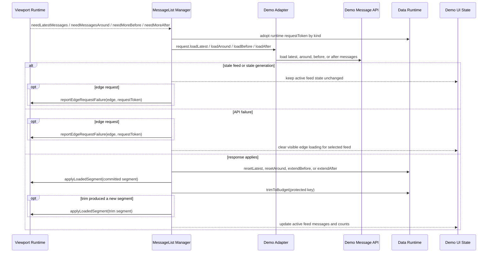
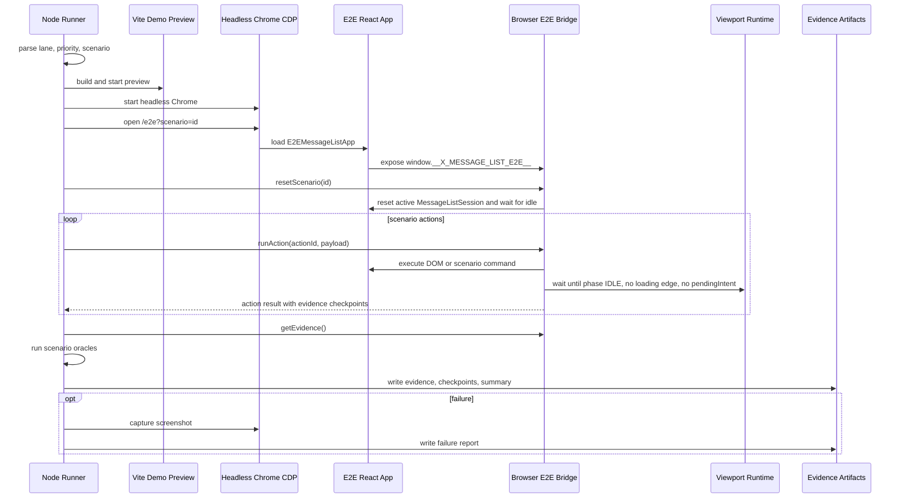

# Demo And E2E

## Demo Manager Adapter

Demo host 通过 manager adapter 响应 runtime semantic events；它不读取 projection
DOM 来补救 scroll 行为。

## E2E Harness

`wait until phase IDLE` includes runtime-owned motion: E2E actions wait for bounded JS scroll motion to settle before collecting the next evidence checkpoint.
