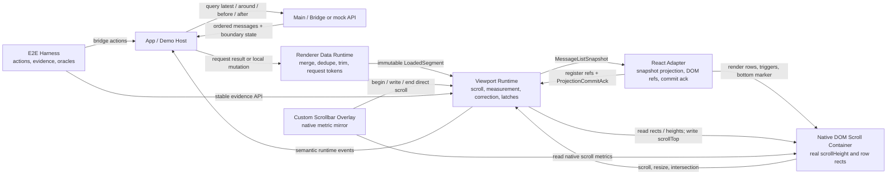
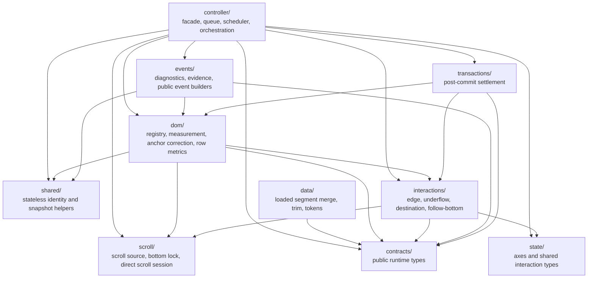

# Module Boundaries

## Package And Runtime Ownership

## Runtime Domain Map

`controller/` 是唯一 orchestration owner；跨域复用的纯 identity/snapshot helper 应留在 `shared/`，避免 DOM、events、interactions 反向依赖 controller。
