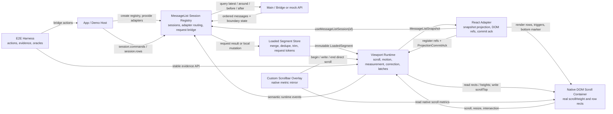
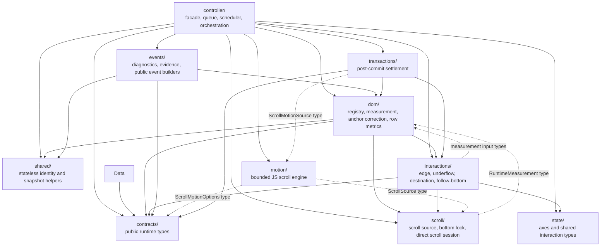

# Module Boundaries

## Package And Runtime Ownership

## Runtime Ownership Map

Legend: solid arrows describe ownership, orchestration, or collaboration. Dashed arrows describe type/helper dependencies that are not ownership edges.

`controller/` 是唯一 orchestration owner；跨域复用的纯 identity/snapshot helper 应留在 `shared/`，避免 DOM、events、interactions 反向依赖 controller。
本图不是完整 import graph；它只标出理解当前 runtime 分域时最容易误判的边界。
