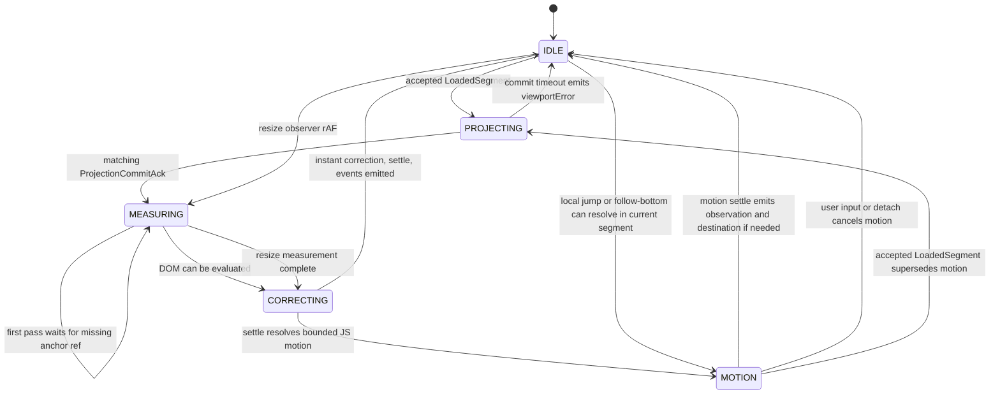
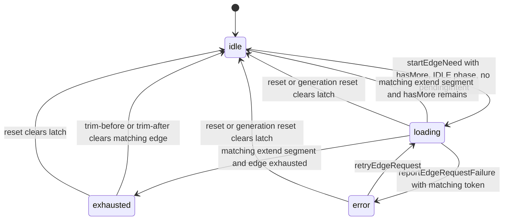
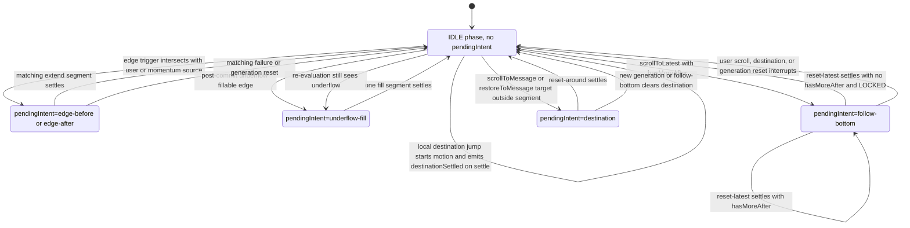

# Runtime States

Runtime 是多条状态轴；不要把这些图合并成一个大状态机。

## Viewport Phase

`settling` 是 internal transaction axis state，不是 public `viewportPhase`。`MOTION` 只表示 runtime 自管的 bounded JS scroll motion；reduced-motion 或 epsilon target 可以同步 settle 回 `IDLE`。

## Edge Slot State

## Pending Intent Arbitration

