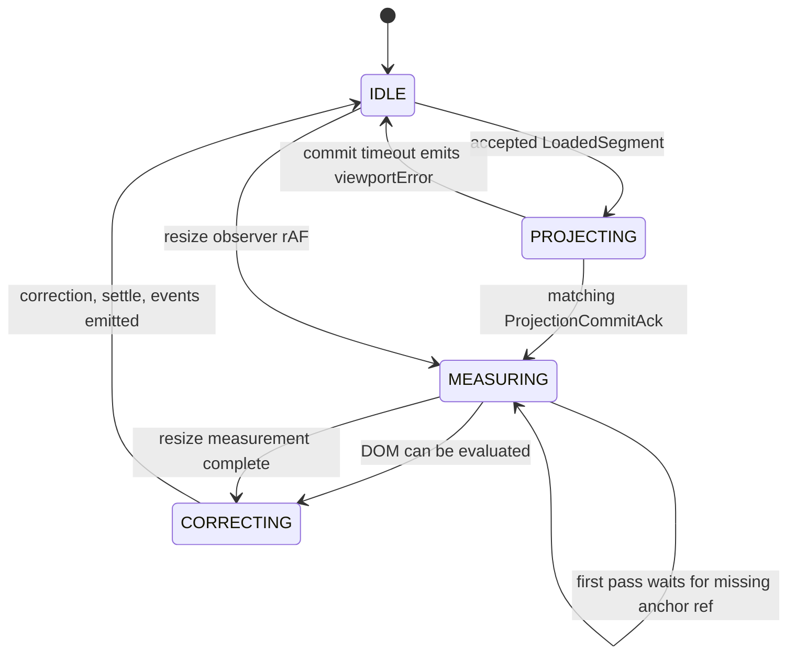
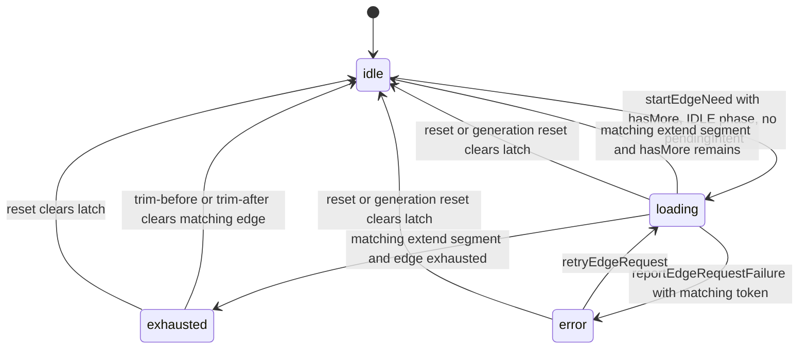
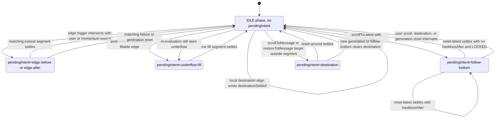

# Runtime States

Runtime 是多条状态轴；不要把这些图合并成一个大状态机。

## Viewport Phase

`settling` 是 internal transaction axis state，不是 public `viewportPhase`。`MOTION` 是当前 contract 保留值；现有 controller 不会 emit，所以不作为真实运行节点绘制。当前实现已预留 internal motion slot，但仍是 no-op，不改变 snapshot phase 或事件。

## Edge Slot State

## Pending Intent Arbitration

