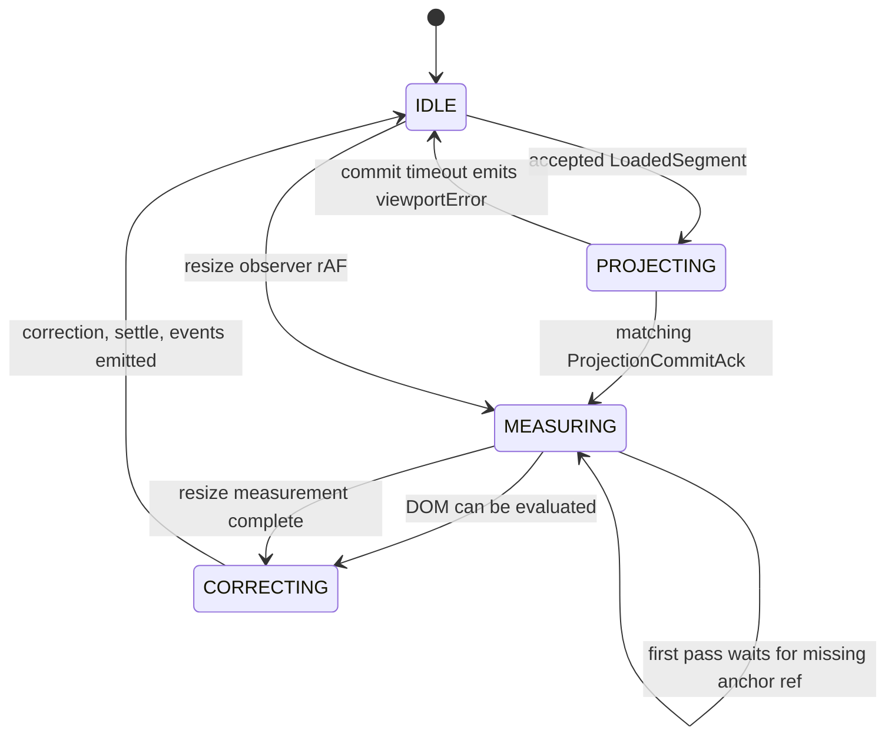
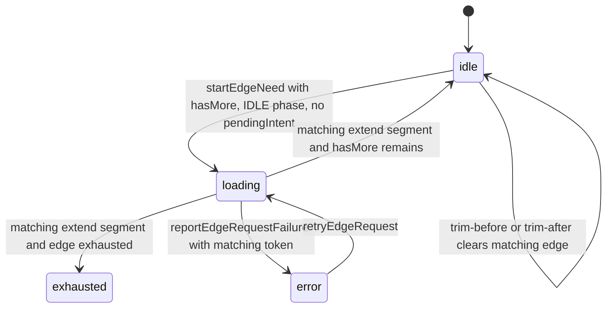
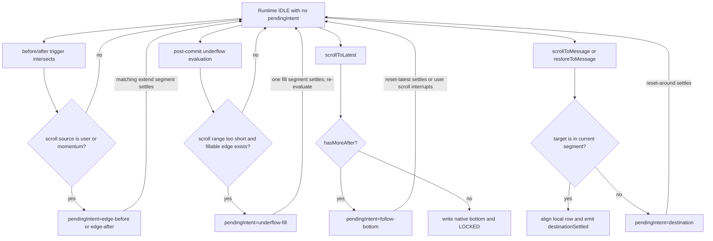

# Runtime States

Runtime 是多条状态轴；不要把这些图合并成一个大状态机。

## Viewport Phase

```mermaid
stateDiagram-v2
  [*] --> Idle
  Idle: IDLE
  Projecting: PROJECTING
  Measuring: MEASURING
  Correcting: CORRECTING

  Idle --> Projecting: accepted LoadedSegment
  Projecting --> Measuring: matching ProjectionCommitAck
  Projecting --> Idle: commit timeout emits viewportError
  Measuring --> Measuring: first pass waits for missing anchor ref
  Measuring --> Correcting: DOM can be evaluated
  Correcting --> Idle: correction, settle, events emitted

  Idle --> Measuring: resize observer rAF
  Measuring --> Correcting: resize measurement complete
```

`settling` 是 internal transaction axis state，不是 public `viewportPhase`。

## Edge Slot State

```mermaid
stateDiagram-v2
  [*] --> Idle
  Idle: idle
  Loading: loading
  Error: error
  Exhausted: exhausted

  Idle --> Loading: startEdgeNeed with hasMore, IDLE phase, no pendingIntent
  Loading --> Idle: matching extend segment and hasMore remains
  Loading --> Exhausted: matching extend segment and edge exhausted
  Loading --> Error: reportEdgeRequestFailure with matching token
  Error --> Loading: retryEdgeRequest
  Idle --> Idle: trim-before or trim-after clears matching edge
```

## Pending Intent Arbitration

```mermaid
flowchart TD
  Ready["Runtime IDLE with no pendingIntent"]
  EdgeHit["before/after trigger intersects"]
  SourceCheck{"scroll source is user or momentum?"}
  EdgePending["pendingIntent=edge-before or edge-after"]
  UnderflowCheck["post-commit underflow evaluation"]
  Fillable{"scroll range too short and fillable edge exists?"}
  UnderflowPending["pendingIntent=underflow-fill"]
  FollowCmd["scrollToLatest"]
  HasAfter{"hasMoreAfter?"}
  FollowPending["pendingIntent=follow-bottom"]
  NativeBottom["write native bottom and LOCKED"]
  DestinationCmd["scrollToMessage or restoreToMessage"]
  LocalTarget{"target is in current segment?"}
  LocalAlign["align local row and emit destinationSettled"]
  DestinationPending["pendingIntent=destination"]

  Ready --> EdgeHit --> SourceCheck
  SourceCheck -->|yes| EdgePending
  SourceCheck -->|no| Ready

  Ready --> UnderflowCheck --> Fillable
  Fillable -->|yes| UnderflowPending
  Fillable -->|no| Ready
  Ready --> FollowCmd --> HasAfter
  HasAfter -->|yes| FollowPending
  HasAfter -->|no| NativeBottom
  Ready --> DestinationCmd --> LocalTarget
  LocalTarget -->|yes| LocalAlign
  LocalTarget -->|no| DestinationPending

  EdgePending -->|"matching extend segment settles"| Ready
  UnderflowPending -->|"one fill segment settles; re-evaluate"| Ready
  FollowPending -->|"reset-latest settles or user scroll interrupts"| Ready
  DestinationPending -->|"reset-around settles"| Ready
```
