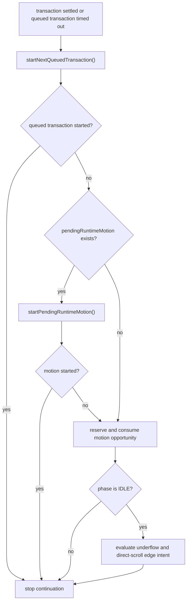
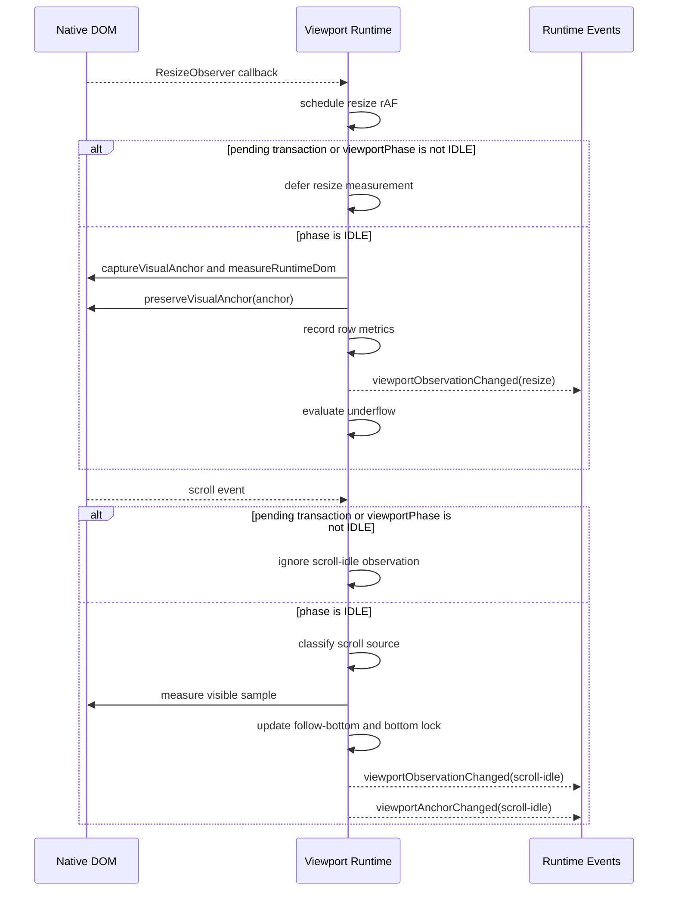

# Runtime Transaction

## Projection Transaction Sequence

```mermaid
sequenceDiagram
  participant Host as Host or Data Publisher
  participant Data as Data Runtime
  participant Runtime as Viewport Runtime
  participant React as React Adapter
  participant DOM as Native DOM
  participant Events as Runtime Events

  Host->>Data: apply request result or local mutation
  Data-->>Host: LoadedSegment with modifier
  Host->>Runtime: applyLoadedSegment(segment)

  alt stale segment
    Runtime-->>Events: viewportDiagnostic(transaction.staleSegment)
  else newer generation segment
    Runtime->>Runtime: cancel older pending transaction
    Runtime->>Runtime: remove queued segments before generation
    Runtime->>Runtime: reset intents unless matching follow-bottom or destination reset
    Runtime->>DOM: captureVisualAnchor()
    Runtime->>Runtime: create ProjectionCommitToken
    Runtime-->>React: snapshot with viewportPhase PROJECTING
    React->>DOM: render rows, triggers, bottom marker
  else same-generation active transaction or advancing queue
    Runtime->>Runtime: enqueue segment and mark transaction queued
  else idle start projection transaction
    Runtime->>DOM: captureVisualAnchor()
    Runtime->>Runtime: create ProjectionCommitToken
    Runtime-->>React: snapshot with viewportPhase PROJECTING
    React->>DOM: render rows, triggers, bottom marker
  end

  opt projection transaction is active
    alt commit timeout before ack
      Runtime->>Runtime: clear pending transaction and set phase IDLE
      Runtime-->>Events: viewportError(commit-timeout)
      Runtime->>Runtime: start next queued transaction
    else React commit ack arrives
      React->>Runtime: ackProjectionCommit(token)
      alt token mismatch
        Runtime-->>Events: viewportDiagnostic(transaction.staleCommitAck)
      else matching token
        Runtime->>DOM: measureRuntimeDom()
        opt anchor ref is missing on first pass
          Runtime->>Runtime: wait one animation frame
          Runtime->>DOM: measureRuntimeDom()
        end
        Runtime->>DOM: correct anchor, resolve destination, or resolve bottom target
        Runtime->>DOM: measureRuntimeDom()
        Runtime->>Runtime: record row metrics
        Runtime->>Runtime: settle interaction state and edge latches
        Runtime-->>Events: viewportReady once per generation
        alt scroll resolution is bounded motion
          Runtime->>Runtime: save pendingRuntimeMotion(settlement, source, segment)
          Runtime->>Runtime: start next queued transaction first
          alt queued transaction started
            Runtime-->>React: snapshot with viewportPhase PROJECTING
            Runtime->>Runtime: keep pendingRuntimeMotion until queue drains or timeout
          else no queued transaction
            Runtime->>Runtime: startPendingRuntimeMotion()
            Runtime-->>React: snapshot with viewportPhase MOTION
            Runtime-->>Events: segmentTrimPressure if needed
            Runtime->>DOM: JS motion writes bounded scroll frames
            alt user input, command supersede, detach, or newer transaction arrives
              Runtime->>Runtime: cancel motion without destination settle
            else motion settles
              Runtime-->>React: snapshot with viewportPhase IDLE
              Runtime-->>Events: viewportObservationChanged(transaction-settle)
              Runtime-->>Events: viewportAnchorChanged(transaction-settle)
              opt reset-around destination
                Runtime-->>Events: destinationSettled
              end
              Runtime->>Runtime: evaluate underflow and direct-scroll edge intent
            end
          end
        else instant resolution
          Runtime-->>React: snapshot with viewportPhase IDLE
          Runtime-->>Events: viewportObservationChanged(transaction-settle)
          Runtime-->>Events: viewportAnchorChanged(transaction-settle)
          opt reset-around destination
            Runtime-->>Events: destinationSettled
          end
          opt segment has trim pressure
            Runtime-->>Events: segmentTrimPressure
          end
          Runtime->>Runtime: run settled continuation priority
          alt queued transaction started
            Runtime-->>React: snapshot with viewportPhase PROJECTING
          else pendingRuntimeMotion exists
            Runtime-->>React: snapshot with viewportPhase MOTION
          else no queued transaction, no pending motion, and phase is IDLE
            Runtime->>Runtime: evaluate underflow and direct-scroll edge intent
          end
        end
      end
    end
  end
```

## Settled Continuation Priority

`pendingRuntimeMotion` is resolved before post-commit underflow or direct-scroll edge evaluation. Command APIs (`scrollToLatest`, `scrollToMessage`, `restoreToMessage`) clear both active motion and pending runtime motion before opening the new intent.

## Resize And Scroll Observation

Motion frame writes are programmatic scroll writes. They do not run the `scroll-idle` observation path while `viewportPhase` is `MOTION`.
