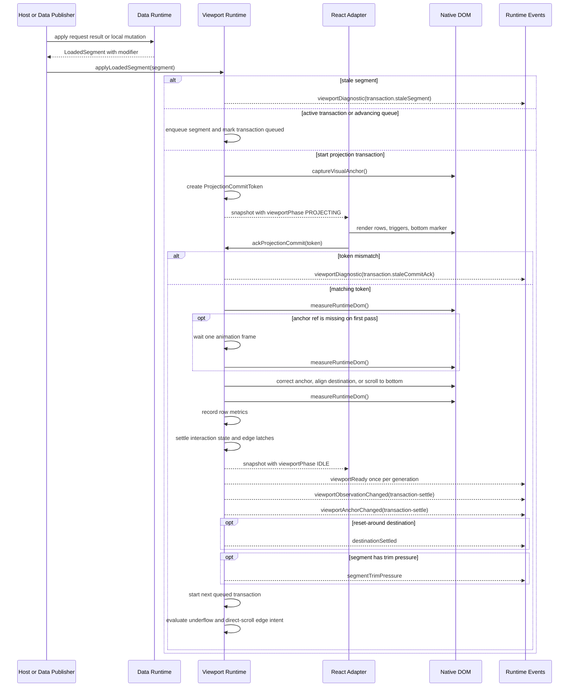
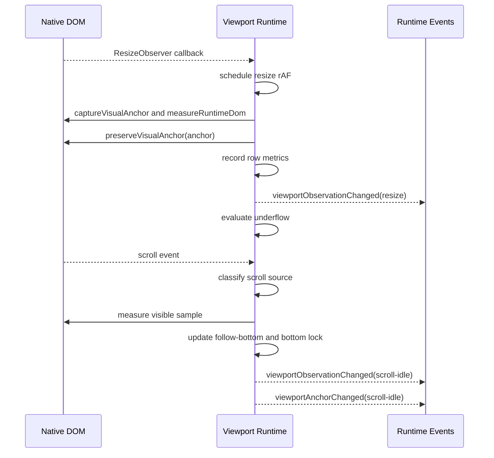

# Runtime Transaction

## Projection Transaction Sequence

```mermaid
sequenceDiagram
  participant Host as Host or Data Publisher
  participant Data as Data Runtime
  participant Runtime as Viewport Runtime
  participant React as React Adapter
  participant DOM as Native DOM
  participant Events as Runtime Events

  Host->>Data: apply request result or local mutation
  Data-->>Host: LoadedSegment with modifier
  Host->>Runtime: applyLoadedSegment(segment)

  alt stale segment
    Runtime-->>Events: viewportDiagnostic(transaction.staleSegment)
  else active transaction or advancing queue
    Runtime->>Runtime: enqueue segment and mark transaction queued
  else start projection transaction
    Runtime->>DOM: captureVisualAnchor()
    Runtime->>Runtime: create ProjectionCommitToken
    Runtime-->>React: snapshot with viewportPhase PROJECTING
    React->>DOM: render rows, triggers, bottom marker
    React->>Runtime: ackProjectionCommit(token)

    alt token mismatch
      Runtime-->>Events: viewportDiagnostic(transaction.staleCommitAck)
    else matching token
      Runtime->>DOM: measureRuntimeDom()
      opt anchor ref is missing on first pass
        Runtime->>Runtime: wait one animation frame
        Runtime->>DOM: measureRuntimeDom()
      end
      Runtime->>DOM: correct anchor, align destination, or scroll to bottom
      Runtime->>DOM: measureRuntimeDom()
      Runtime->>Runtime: record row metrics
      Runtime->>Runtime: settle interaction state and edge latches
      Runtime-->>React: snapshot with viewportPhase IDLE
      Runtime-->>Events: viewportReady once per generation
      Runtime-->>Events: viewportObservationChanged(transaction-settle)
      Runtime-->>Events: viewportAnchorChanged(transaction-settle)
      opt reset-around destination
        Runtime-->>Events: destinationSettled
      end
      opt segment has trim pressure
        Runtime-->>Events: segmentTrimPressure
      end
      Runtime->>Runtime: start next queued transaction
      Runtime->>Runtime: evaluate underflow and direct-scroll edge intent
    end
  end
```

## Resize And Scroll Observation

```mermaid
sequenceDiagram
  participant DOM as Native DOM
  participant Runtime as Viewport Runtime
  participant Events as Runtime Events

  DOM-->>Runtime: ResizeObserver callback
  Runtime->>Runtime: schedule resize rAF
  Runtime->>DOM: captureVisualAnchor and measureRuntimeDom
  Runtime->>DOM: preserveVisualAnchor(anchor)
  Runtime->>Runtime: record row metrics
  Runtime-->>Events: viewportObservationChanged(resize)
  Runtime->>Runtime: evaluate underflow

  DOM-->>Runtime: scroll event
  Runtime->>Runtime: classify scroll source
  Runtime->>DOM: measure visible sample
  Runtime->>Runtime: update follow-bottom and bottom lock
  Runtime-->>Events: viewportObservationChanged(scroll-idle)
  Runtime-->>Events: viewportAnchorChanged(scroll-idle)
```
