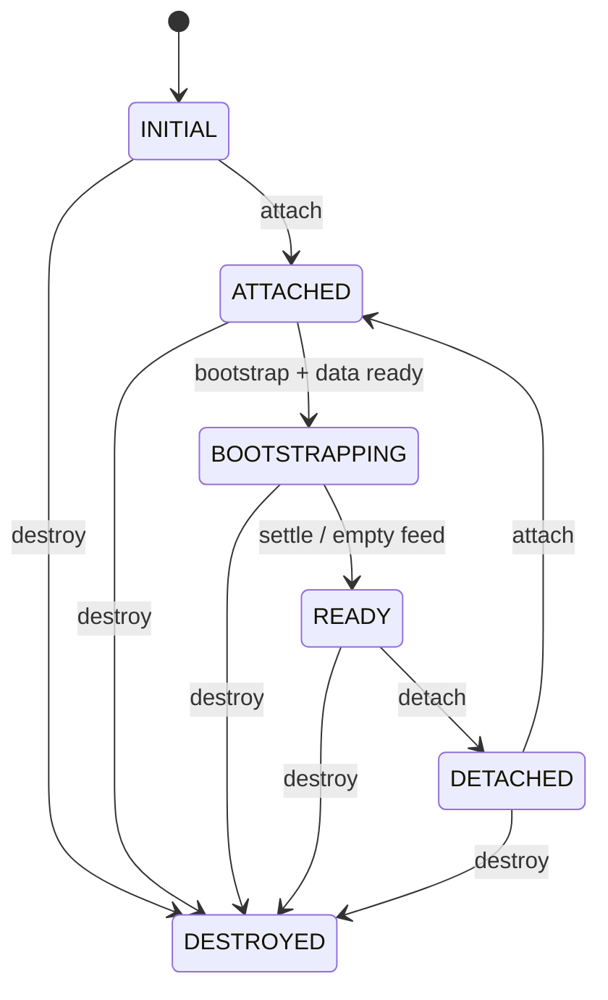
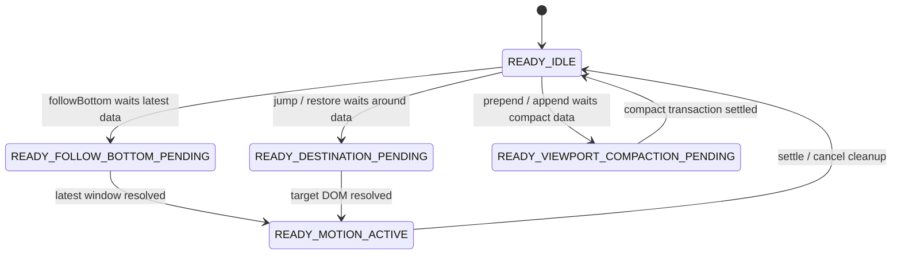
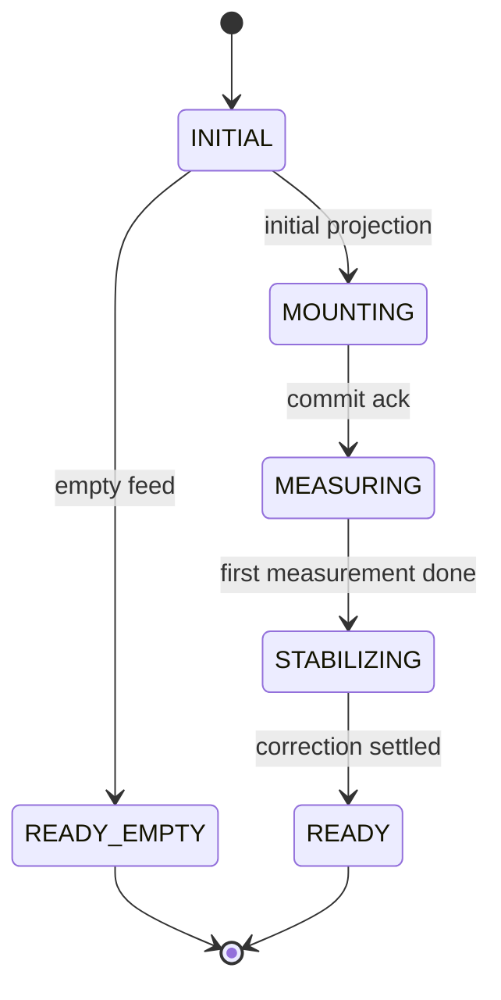
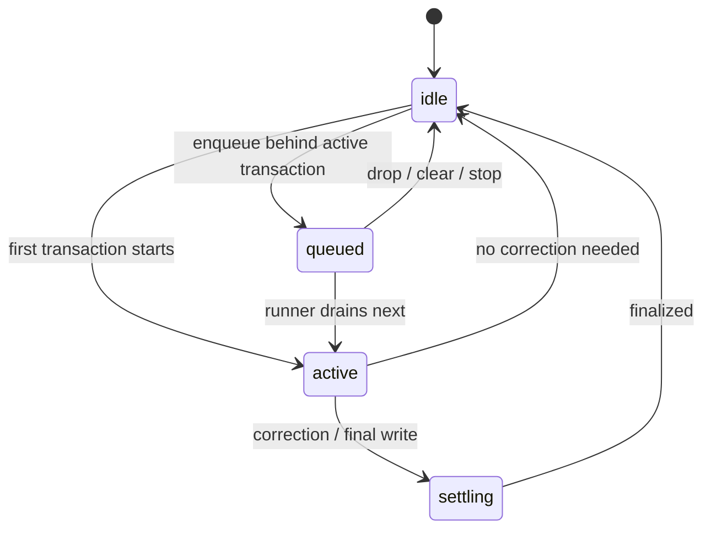
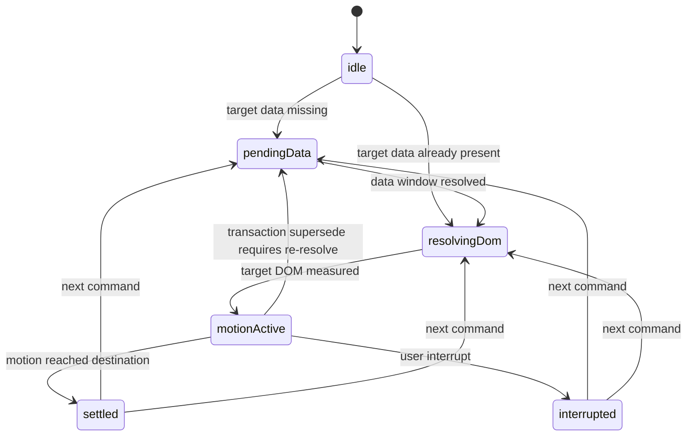
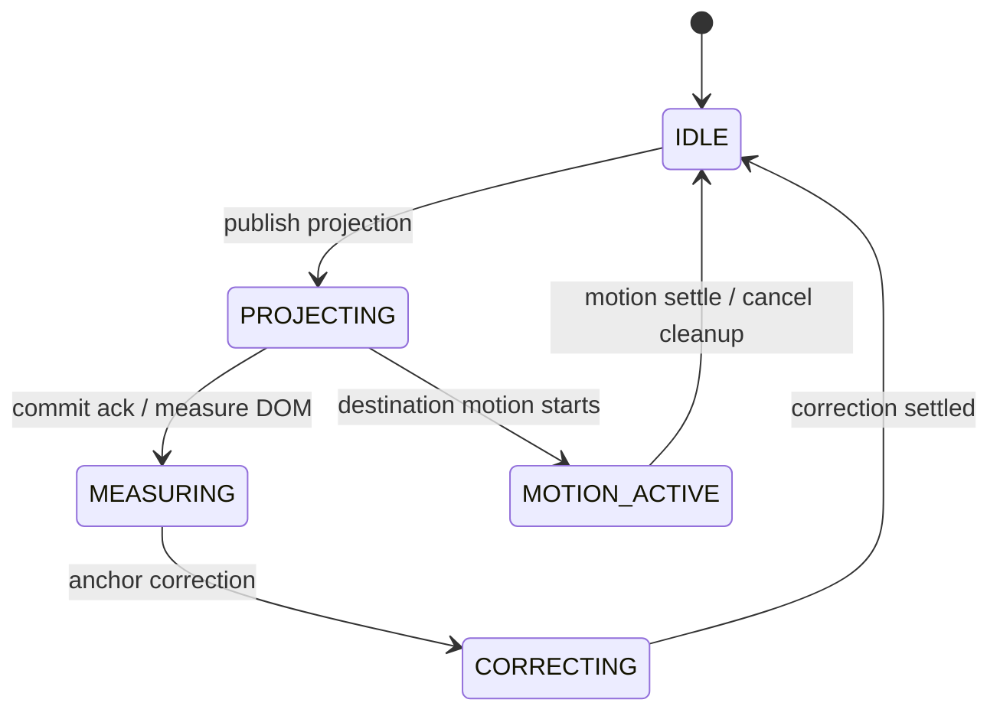
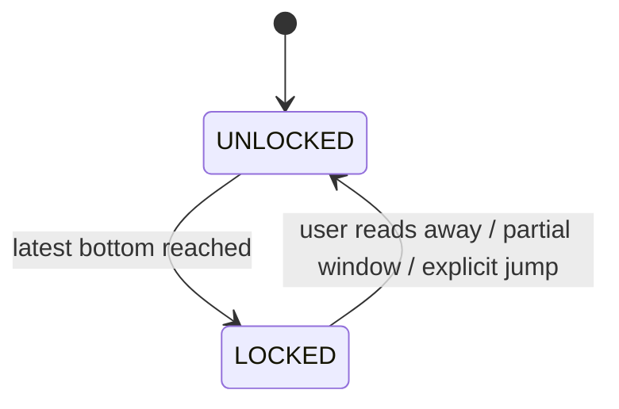
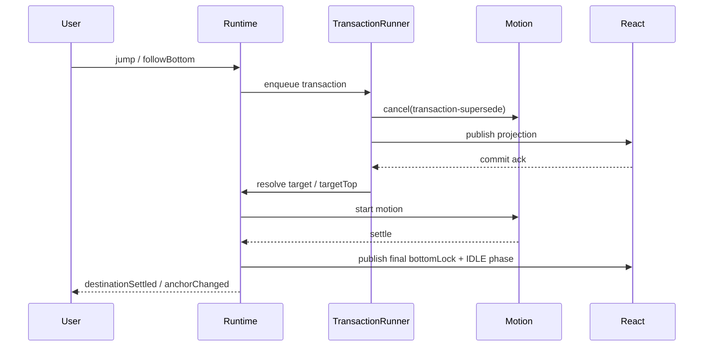

# Runtime 容器内核架构

## 1. Scope

本文档定义滚动视图容器 runtime 的内部模块和公开 surface。

本文不讨论：

- 数据如何从 SDK 读取
- anchor 如何跨 main / renderer 传递
- message row 的视觉设计
- legacy 容器迁移方案

## 2. Runtime Shape

推荐核心对象：

```ts
class MessageViewportRuntime {
  attach(container: HTMLElement): void;
  detach(): void;
  destroy(): void;

  setDataSnapshot(snapshot: MessageDataSnapshot): void;
  dispatch(command: MessageRuntimeCommand): void;

  subscribe(listener: RuntimeListener): () => void;
  subscribeEvent(listener: RuntimeEventListener): () => void;
  subscribeViewportObservation(listener: ViewportObservationListener): () => void;
  getSnapshot(): MessageViewportSnapshot;
  getViewportAnchorState(): AnchorState | null;

  registerRow(key: MessageRuntimeItemKey, element: HTMLElement | null): void;
  registerTopSpacer(element: HTMLElement | null): void;
  registerBottomSpacer(element: HTMLElement | null): void;
  registerTopSentinel(element: HTMLElement | null): void;
  registerBottomSentinel(element: HTMLElement | null): void;

  notifyProjectionCommitted(commit: ProjectionCommit): void;
}
```

`register*` 是 React projection 和 runtime 的 DOM 桥。Runtime 不通过 React state 获取 DOM，也不要求 React 传业务 message 对象给 measurement。

说明：

- `getViewportAnchorState()` 是 renderer 本地恢复位点导出能力，只返回当前 viewport 的 `AnchorState`，不跨进程。
- 诊断辅助（例如 `getDebugSnapshot()`）不属于稳定合同，因此不在这里列为公开 surface。

## 3. Internal Modules

| Module | Responsibility | React 可见 |
| --- | --- | --- |
| MessageViewportRuntime | 稳定 public facade，保持接入 API 不扩散 | 直接接入 |
| MessageViewportRuntimeController | 组合 runtime parts、维护生命周期状态、路由 command / data effect | 不直接可见 |
| ProjectionStore | 保存并发布 `MessageViewportSnapshot` | 通过 `getSnapshot` |
| ProjectionCoordinator | 计算 projection snapshot、spacer、revision equality | 通过 snapshot |
| CommitCoordinator | 等待 React commit ack、处理 timeout / cancel | 不直接可见 |
| DomRegistry | container、row、spacer、sentinel refs | 不可见 |
| AnchorCoordinator | 捕获 viewport anchor、解析 restore target、选择 nearest measurable row | 不直接可见 |
| RenderWindowEngine | 计算 mount item 范围和 trim 计划 | `renderWindow` |
| SpacerEngine | 估算并修正 spacer 高度 | `topSpacer` / `bottomSpacer` |
| MeasurementEngine | 同步测量、ResizeObserver、height cache | 不直接可见 |
| ScrollIntentEngine | 区分 user / programmatic / recovery / follow bottom / jump | `bottomLockState` |
| ScrollMotionEngine | 执行 bounded JS scroll motion、同步取消和 settle 回调 | 不直接可见 |
| DestinationMotionCoordinator | 持有目的地滚动 settle/cancel 语义，并协调 final anchor event | 不直接可见 |
| TransactionRunner | 串行化 transaction queue | 不直接可见 |
| ViewportTransactionController | 执行 bootstrap / prepend / append / jump / restore / followBottom / resize transaction body | 不直接可见 |
| EdgeNeedCoordinator | sentinel、edge latch、needMoreBefore / needMoreAfter 事件 | 不直接可见 |
| LifecycleGuard | generation、destroy、detach、异步资源清理 | 不直接可见 |

## 4. Snapshot Boundary

只有 projection 必须渲染的字段进入 snapshot。

```ts
type MessageViewportSnapshot = {
  feedId: string;
  generation: number;
  revision: number;
  items: MessageDataItem[];
  renderWindow: RenderWindow;
  topSpacer: number;
  bottomSpacer: number;
  bottomLockState: BottomLockState;
  bootstrapState: BootstrapState;
  viewportPhase: ViewportPhase;
  edgeState: ViewportEdgeState;
};
```

必须进入 snapshot：

- `items`
- `renderWindow`
- `topSpacer`
- `bottomSpacer`
- `bottomLockState`
- `bootstrapState`
- `viewportPhase`
- 边缘 loading / exhausted 状态

禁止进入 snapshot：

- `scrollTop`
- measured row rects
- ResizeObserver entries
- internal transaction object
- command queue
- height cache map
- raw DOM refs
- momentum / wheel event details

规则：

```text
会改变 React 要渲染什么，才进入 snapshot。
只影响 runtime 如何稳定视口，不进入 snapshot。
```

## 5. Snapshot Revision

Runtime snapshot revision 只在 projection 输出变化时递增：

- renderWindow item keys 变化
- spacer 高度变化
- bottom lock UI 状态变化
- bootstrap / edge 状态变化
- data item projection 版本变化

以下变化不递增 snapshot revision：

- 用户滚动但 window 未滑动
- height cache 更新但 spacer 不变
- ResizeObserver 回调被合并但无需 projection
- runtime 内部 command queue 变化

React adapter 依赖 revision 做 commit 回执，但不能把 revision 当作业务数据版本。

## 6. DOM Contract

推荐 DOM 结构：

```html
<div data-message-viewport>
  <div data-top-sentinel></div>
  <div data-top-spacer style="height: ...px"></div>
  <div data-message-window>
    <div data-message-row="..."></div>
  </div>
  <div data-bottom-spacer style="height: ...px"></div>
  <div data-bottom-sentinel></div>
</div>
```

约束：

- row 必须处于正常文档流。
- spacer 也是正常文档流元素。
- container 是唯一 scroll container。
- `overflow-anchor: none` 放在 scroll container 或 message window 根节点。
- row key 必须使用 `MessageRuntimeItemKey`，不能使用 render index。

## 7. Runtime State Machine

Runtime 是分层状态机，不是单一 `RuntimeState`。实现和接入层都不能只用
`state === READY` 判断用户动作已经完成；必须结合 `ReadySubstate`、transaction
队列、active motion、`viewportPhase` 和 `bottomLockState`。

本节描述当前实现的目标模型。它不是把所有状态塞进一个 enum，而是把 runtime
拆成多条正交状态轴：生命周期、bootstrap、transaction、destination、visual
phase、bottom lock。每条轴只回答一个问题，任何代码都不应跨轴复用语义。

```ts
type RuntimeState =
  | 'INITIAL'
  | 'ATTACHED'
  | 'BOOTSTRAPPING'
  | 'READY'
  | 'DETACHED'
  | 'DESTROYED';
```

转移规则：

| From | Event | To |
| --- | --- | --- |
| INITIAL | attach | ATTACHED |
| ATTACHED | bootstrap command + data ready | BOOTSTRAPPING |
| BOOTSTRAPPING | settle | READY |
| READY | transaction start | READY |
| READY | transaction commit | READY |
| ATTACHED / READY | detach | DETACHED |
| DETACHED | attach | ATTACHED |
| any non-destroyed | destroy | DESTROYED |

`detach` 不等同于 `destroy`。React StrictMode 下允许 `attach -> detach -> attach`，runtime 必须保持幂等。



`READY` 可以有 runtime 私有子状态，但这些子状态不进入 public snapshot：

```ts
type ReadySubstate =
  | 'READY_IDLE'
  | 'READY_FOLLOW_BOTTOM_PENDING'
  | 'READY_DESTINATION_PENDING'
  | 'READY_VIEWPORT_COMPACTION_PENDING'
  | 'READY_MOTION_ACTIVE';
```

规则：

- `READY_FOLLOW_BOTTOM_PENDING` 表示显式 `followBottom` 已经转成
  `needLatestMessages(bottom-follow)`，正在等待 latest DataWindow；它不是 transaction。
- `READY_DESTINATION_PENDING` 表示显式 `jump` / `restore` 的目标不在当前
  DataWindow，runtime 已发出 `needMessagesAround`，正在等待接入层围绕目标
  重建窗口；它也不是 transaction。
- `READY_VIEWPORT_COMPACTION_PENDING` 表示当前 DataWindow 的 spacer 已超过
  runtime 阈值，下一次 prepend / append 被升级为围绕当前视觉 anchor 的 around
  重建请求；它也不是 transaction。
- `READY_MOTION_ACTIVE` 表示 `ScrollMotionEngine` 正在拥有 `scrollTop` 写入权。
- 任意新 transaction 启动前，`TransactionRunner` 必须同步取消 active motion。
- Motion settle 可以保持 public state 为 `READY`，但必须在 settle 后再 emit
  `viewportAnchorChanged(transaction-settle)`。



### 7.1 Orthogonal State Layers

这些状态层相互正交，分别表达不同所有权：

| Layer | Owner | Meaning |
| --- | --- | --- |
| `RuntimeState` | runtime lifecycle | attach/bootstrap/detach/destroy |
| `ReadySubstate` | runtime command intent | pending latest / pending destination / active motion |
| `TransactionState` | transaction serialization | queued / active / settling / idle |
| `DestinationState` | destination intent | pendingData / resolvingDom / motionActive / settled / interrupted |
| `TransactionRunner` | mutation serialization | window、spacer、DOM commit、measurement 的串行所有权 |
| `ScrollMotionEngine` | scroll writer | animation 期间唯一写 `scrollTop` 的 owner |
| `bottomLockState` | scroll intent | 只表达 latest bottom lock |
| `viewportPhase` | visual phase | projection、measurement、correction、motion 中间态 |

`bottomLockState` 只能是 `LOCKED / UNLOCKED`。Projection/recovery/motion 的中间态
必须由 `viewportPhase` 表达，不能再塞回 bottom lock。`TransactionState` 和
`DestinationState` 只用于 controller 内部诊断与守卫，不进入 public snapshot。

稳定语义只能来自最终 settle：

- jump / restore：目标 DOM commit、测量、motion settle 后才算完成。
- followBottom：latest window commit、motion 到达物理 latest bottom 后才算 `LOCKED`。
- prepend / resize / refresh：anchor correction 完成后才允许 emit settled anchor。

### 7.2 Bootstrap State Axis

Bootstrap 是独立子状态机。`RuntimeState.BOOTSTRAPPING` 只表示 runtime 处于首屏启动
生命周期；具体允许哪些副作用必须看 `BootstrapState`。



阶段许可表必须和实现保持一致：

| BootstrapState | Projection | Measurement | Correction | Trim | Edge Need |
| --- | --- | --- | --- | --- | --- |
| `MOUNTING` | allowed | forbidden | forbidden | forbidden | forbidden |
| `MEASURING` | allowed | allowed | forbidden | forbidden | forbidden |
| `STABILIZING` | allowed | allowed | allowed | forbidden | forbidden |
| `READY` | allowed | allowed | allowed | allowed | allowed |

关键约束：

- `MEASURING` 可以读 DOM / height，但不能写 correction，也不能触发分页。
- `STABILIZING` 可以做首屏必要 correction，但仍不能 trim，也不能发 edge need。
- `READY_EMPTY` 是空 feed 的稳定完成态，不是中间态。
- 普通 READY 事务不能借用 bootstrap 禁令；它们由 transaction / viewportPhase 约束。

### 7.3 Transaction State Axis

`TransactionState` 只描述 projection、DOM commit、measurement、correction 的串行化。
它不代表用户目的地完成，也不改变 `RuntimeState`。



语义边界：

- `active` 表示 transaction body 正在持有 mutation 串行权。
- `settling` 表示 transaction 已进入最终 correction / anchor settle 阶段。
- `queued` 只表示还有等待执行的 transaction，不表示当前 active transaction 仍未完成。
- transaction 可以启动 destination motion，但 motion 本身不是 transaction。

当前实现说明：

- `TransactionRunner` 是真实队列执行器。
- controller diagnostics 会输出 `transactionState`，用于串联日志。
- 事务体仍会在局部阶段写 `active / settling / idle`。这符合当前行为，但不是最终最干净的单一真源模型；后续收敛时应让 `TransactionRunner` 统一发布 queue/active/idle，事务体只表达 `settling` 或更细的 transaction phase。

### 7.4 Destination State Axis

`DestinationState` 只描述 jump / restore / followBottom 的用户目的地意图生命周期。
它不代表 DOM projection 是否完成，也不等同于 bottom lock。



语义边界：

- `pendingData` 表示 runtime 已保留用户意图，并请求 latest / around data。
- `resolvingDom` 表示 data 已在当前 window，正在等待 projection commit 后解析 DOM。
- `motionActive` 表示目的地坐标已经解析，scroll writer 由 motion 接管。
- `settled` / `interrupted` 是终态诊断值，可以保留到下一次目的地命令覆盖。

关键禁令：

- `transaction-supersede` 不能把 `motionActive` 直接变成 `settled`。
- 真实用户 wheel / drag / gesture 才能把目的地意图终止为 `interrupted`。
- jump 的 `destinationSettled` 只能在目标 DOM resolve 且最终 motion settle 后发送。
- followBottom 的 `LOCKED` 只能在 latest window + 物理底部 settle 后发布。

### 7.5 Viewport Phase Axis

`ViewportPhase` 是 React 可见的视觉中间态。它解释 projection 正在经历什么，
但不承载业务吸底语义，也不承载用户目的地意图。



React adapter 可以读取 `viewportPhase` 做稳定 projection 判断，但不能接管 scroll 语义。
例如 follow-bottom slot 是否存在，应由 runtime snapshot 的稳定业务状态和 projection
共同决定，不能在 adapter 中用临时冻结补偿 runtime 状态机缺陷。

### 7.6 Bottom Lock Axis

`bottomLockState` 只表达当前 viewport 是否锁在 feed latest。



约束：

- `LOCKED` 不表示 motion 正在恢复，也不表示 projection 已完成。
- `UNLOCKED + MOTION_ACTIVE` 是合法状态，例如 quote jump 动画期间。
- `LOCKED + PROJECTING` 是合法状态，例如 bottom locked append projection 期间。
- `hasMoreAfter=true` 的 partial window 不能投影成 `LOCKED`。

### 7.7 Supersede Rules

`transaction-supersede` 只表示旧 motion 的坐标失效，不表示用户意图取消。

- active `followBottom` 被 append / resize supersede 后，必须在新 projection commit 后
  重新计算 latest bottom target 并继续 motion。
- active `jump` 被 data / resize supersede 后，必须重新解析 target DOM 和 `targetTop`；
  被取消的半程 motion 不能 emit `destinationSettled`。
- user interrupt 与 transaction supersede 必须分离：真实用户 wheel / drag / gesture
  取消 jump 后不能自动重启，也不能保留 pending destination。
- reset / generation change / detach / destroy 是隔离边界，必须清掉 pending intent、
  active motion、commit wait 和 measurement cache。



### 7.8 Current Implementation Review Notes

当前实现已经完成的正向收敛：

- `RuntimeState` 已从业务事务状态中抽离，只表达 attach/bootstrap/detach/destroy。
- `BottomLockState` 已删除 `RECOVERING`，只保留 `LOCKED / UNLOCKED`。
- `viewportPhase` 已成为 projection / measurement / correction / motion 的视觉出口。
- Bootstrap 已有阶段许可表，`MEASURING / STABILIZING` 的副作用边界明确。
- jump / followBottom 的稳定完成语义已下沉到 motion settle，而不是 transaction commit。

仍需保持警惕的收敛点：

- `TransactionState` 目前同时由 `TransactionRunner` 回调和 transaction body 写入；
  长期应收敛为单一写入模型，避免 diagnostics 中出现 queue/active/idle 时序偏差。
- `DestinationState` 的 `settled / interrupted` 当前是 sticky diagnostic terminal state；
  这是可解释的，但必须明确它不是“当前仍在执行目的地命令”。
- 如果未来新增 `transactionPhase`，应只描述 transaction body 的内部阶段，不能再把它
  混回 lifecycle、destination 或 bottom lock。

## 8. Public Events

Runtime 可以向外发出 view-level 事件：

```ts
type MessageViewportRuntimeEvent =
  | {
      type: 'needMoreBefore';
      feedId: string;
      generation: number;
      reason: 'near-top' | 'prepend-recovery';
    }
  | {
      type: 'needMoreAfter';
      feedId: string;
      generation: number;
      reason: 'near-bottom';
    }
  | {
      type: 'needLatestMessages';
      feedId: string;
      generation: number;
      reason: 'bottom-follow';
    }
  | {
      type: 'needMessagesAround';
      feedId: string;
      generation: number;
      reason: 'jump' | 'restore' | 'viewport-compaction';
      target: MessageIdentityAnchor;
    }
  | {
      type: 'destinationSettled';
      feedId: string;
      generation: number;
      intent: 'jump';
      target: MessageIdentityAnchor;
      resolution: 'target' | 'fallback-deleted';
      resolvedTarget?: MessageIdentityAnchor;
    }
  | {
      type: 'viewportAnchorChanged';
      feedId: string;
      generation: number;
      reason: 'scroll-idle' | 'transaction-settle' | 'detach';
      anchor: AnchorState | null;
    }
  | { type: 'viewportReady'; feedId: string; generation: number }
  | { type: 'viewportError'; feedId: string; generation: number; code: string };
```

这些事件只能表达 viewport 需求，不携带 SDK query 细节。
`viewportObservationChanged` 不属于 `MessageViewportRuntimeEvent`；它通过
`subscribeViewportObservation` 专用 stream 暴露，避免普通 event listener 激活
visible range 测量。

当前实现会在用户接近 after edge 时发出 `needMoreAfter(reason: 'near-bottom')`。
这是“用户向下浏览”的逐页分页信号。

`needMoreBefore` / `needMoreAfter` 只能在 runtime 已经完成 bootstrap、public
state 为 `READY`、内部子状态为 `READY_IDLE`、projection `bootstrapState` 为
`READY`，且 scroll source 是 user / momentum 时发出。user / momentum 必须
来自当前激活期的近期用户输入意图；unknown scroll、container attach 恢复
`scrollTop`、restore 对齐、旧 feed 激活期残留的 `lastScrollSource` 都不能触发
edge paging。BOOTSTRAPPING / MOUNTING、commit timeout recovery、pending
follow-bottom、pending destination 和 motion active 期间也都不能发 edge paging
event。否则恢复失败或 runtime 自己写 `scrollTop` 会被 sentinel 放大成错误分页。

bottom lock 可以在非用户生命周期边界做只进不退校准：当 `hasMoreAfter=false`
且真实 `distanceToBottom` 已在 lock threshold 内，runtime 可以把 stale
`UNLOCKED` 提升为 `LOCKED`。这用于 restored bootstrap、cached attach 以及
append / refresh 追底判断前的状态修正；它不能把 programmatic 远离底部解释成
用户离底，也不能在 `hasMoreAfter=true` 的 partial window 上锁底。

外部显式 `followBottom` 但当前 DataWindow 仍有 `hasMoreAfter=true` 时，runtime
发出 `needLatestMessages(reason: 'bottom-follow')`。接入方必须直接请求 latest
window 并替换 DataWindow，不能沿当前 after edge 逐页补齐中间空洞。
pending 期间只有 `change.kind='reset'` 且 `hasMoreAfter=false` 的 latest
rebuild snapshot 才能消费该 intent；普通 append / patch 即使暂时
`hasMoreAfter=false` 也只能触发 runtime 继续请求 latest。

外部显式 `jump` / `restore` 但目标不在当前 DataWindow 时，runtime 发出
`needMessagesAround(reason: 'jump' | 'restore', target)`。接入方必须围绕 target
执行 around query 并替换 DataWindow，不能顺序补齐当前窗口和目标之间的消息。
pending 期间只有 `change.kind='reset'` 的 around rebuild snapshot 才会继续解析
target / deleted fallback；普通 append / patch 即使包含 target，也不能消费该
pending。

当 READY_IDLE 下已有 projection 的单侧 spacer 超过 runtime compaction 阈值，
或完整 DataWindow 的 item 数超过 `viewportCompaction.dataWindowItemThreshold`
（默认 500）时，下一次 `prepend` / `append` 数据到达不会继续扩大当前
DataWindow。Runtime 会捕获当前 viewport 顶部的 committed anchor，发出
`needMessagesAround(reason: 'viewport-compaction', target)`，由接入方围绕该
anchor 返回短 DataWindow。返回 snapshot 被 `viewportCompaction` transaction 消费，
commit 后按原 `offsetWithinMessage` 校正 `scrollTop`，释放旧 spacer 且保持可见内容
不跳变。
compaction pending 只消费 `change.kind='reset'` 且包含 pending target 或 deleted
fallback 的 around rebuild snapshot；普通 append / prepend / patch 不能因为仍包含
当前视觉 anchor 就提前完成 compaction。

显式 `jump` / `restore` / `followBottom` 也必须遵守同一个窗口预算：如果目标虽然
已经落在当前 DataWindow 内，但当前 DataWindow 已经超过 spacer 或 item 数预算，
runtime 仍然发出 around/latest rebuild 请求，避免用一次局部目的地滚动继续保留
过大的数据窗口。每个超过 item 数预算的 data snapshot 会在 data diagnostics 中
记录 `data.windowBudgetExceeded`，用于定位接入层没有返回短窗口的场景。

显式 `followBottom` 的 `bottom-follow` 语义由 runtime pending command 保持。
在 pending 期间，runtime 不发普通 `near-bottom`，也不把当前 DataWindow 的物理
底部解释成 feed latest bottom。用户主动向上滚动、jump / restore / reset、
generation change 或 detach 会取消 pending command。`jump` / `restore` 的
around-target pending 由后续 matching snapshot 消费；新的 destination command、
reset、generation change 或 detach 会取消它。`viewport-compaction` pending 同样由
matching snapshot 消费，新的 destination command、reset、generation change 或 detach
会取消它。

React/demo 层不得用 raw `scrollTop` / `scrollHeight` 自行重建向下分页判断；
否则会绕过 runtime 的 scroll source classification、edge latch 和 transaction
时序，导致吸底与向下分页相互打架。

React/demo 层也不得 query projection DOM 或注册 raw scroll listener 来保存
恢复位点。Runtime 在 scroll rAF / transaction settle 后发出
`viewportAnchorChanged`，并且在 `detach()` 清掉 DOM refs 前发出
`viewportAnchorChanged(reason: 'detach')` 作为 viewport deactivation checkpoint。
React adapter 必须透传完整 event，包括 `feedId` 和 `generation`；是否持久化、
持久化到哪里属于 data/demo/app 层。

如果某次 transaction 之后启动了 scroll motion，`transaction-settle` 事件由
motion settle callback 发出；transaction commit callback 不得为同一目的地滚动
提前发出第二次 anchor event。没有 motion 的 transaction 仍可在同步 correction
完成后发出 `transaction-settle`。

## 9. Implementation Order

推荐顺序：

1. ProjectionStore + `useSyncExternalStore` adapter。
2. DomRegistry + commit 回执。
3. latest bootstrap 到 bottom locked。
4. prepend transaction。
5. dynamic height stabilization。
6. RenderWindow sliding 和 trim。
7. jump / restore。
8. feed teardown 和 StrictMode 压测。
