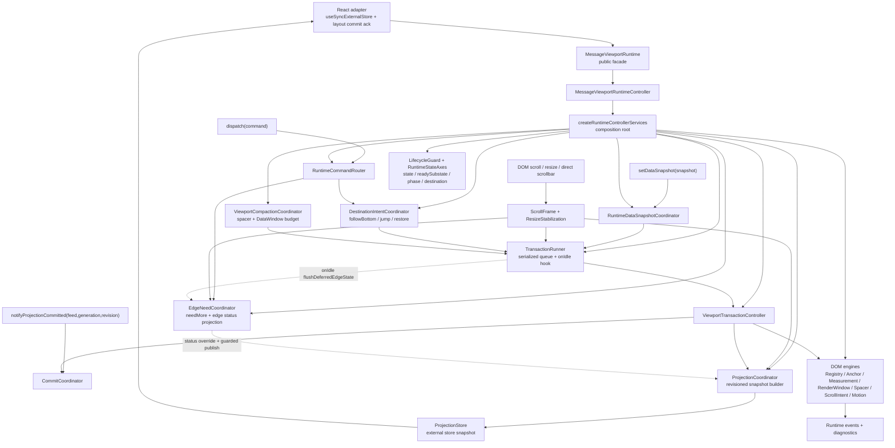
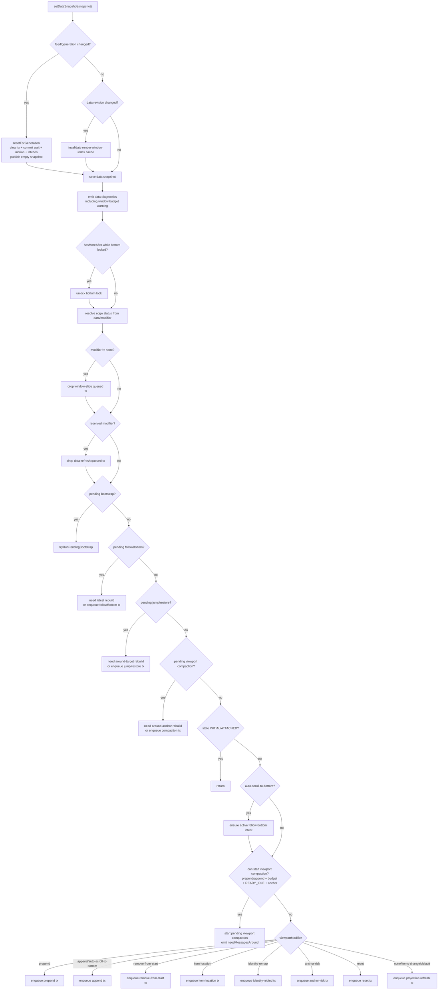
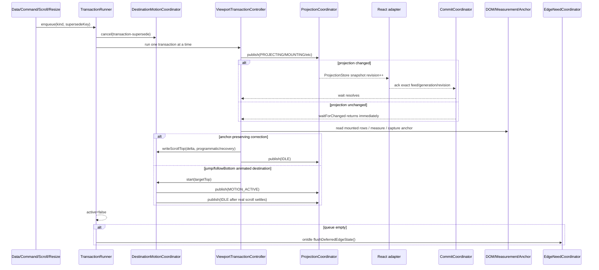
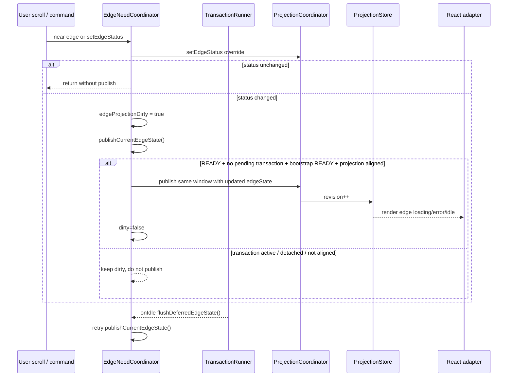
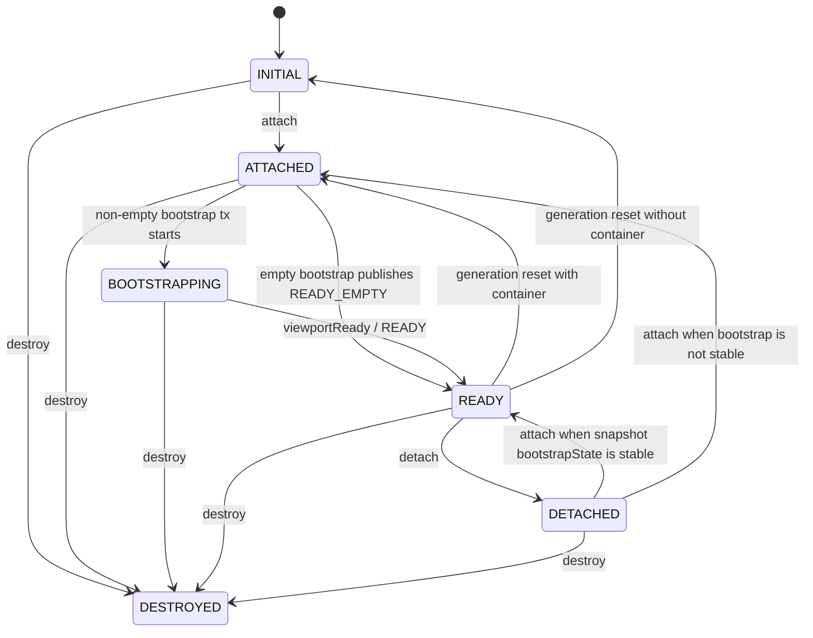
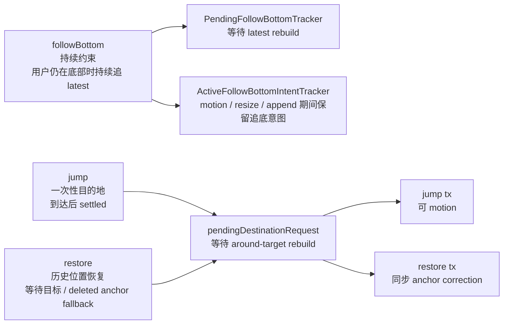

基准：当前 `HEAD 51098e4`。本文件按最新 `src/runtime` 刷新，旧基准 `226231d` 的图已不再准确；`04d3f51` 之后新增的 ready reattach edge flush 也已纳入。

**1. 总体架构图**

核心变化：edge loading/error 已进入 runtime projection，但不再无条件抢发。edge status override 会先记录在 `ProjectionCoordinator` 内，随后标记 dirty；只有 runtime 处于 READY、没有 pending transaction、bootstrapState 为 READY，且当前 projection window 与 data window 对齐时，才会写入 ProjectionStore。事务队列空闲时由 `TransactionRunner.onIdle` flush。

**2. 数据进入 runtime 后的路由**

关键点：当前路由优先级本身就是架构规则，不是可随意重排的 if/else。snapshot 接收、generation reset、edge resolve 之后，必须先处理 pending bootstrap，再处理 pending followBottom，再处理 pending jump/restore，再处理 pending compaction，最后才进入普通 modifier。DataWindow item budget 已经和 spacer budget 一起参与 destination rebuild 与 compaction 判断；但 compaction 真正启动还要求 READY_IDLE、bottom 未锁定、非 generation change，并且能捕获 committed viewport anchor。

**3. 事务与 projection commit 时序**

正确性边界仍然是：projection 变化后必须等 React commit ack，之后才读 DOM。`CommitCoordinator` 只接受精确 revision ack；旧 commit 不能唤醒新事务。

**4. edge 状态发布时序**

补充：ready runtime detach 后收到 `setEdgeStatus` 不会立刻改 snapshot；reattach 时 lifecycle 会 `flushCurrentEdgeState()`，把仍有效的 edge override 发布出来。

**5. lifecycle 状态模型**

`RuntimeState` 只表达生命周期。`readySubstate`、`viewportPhase`、`transactionState`、`destinationState`、`bottomLockState`、motion active、edgeState 都是正交轴，不能只看 `READY` 推断滚动、跳转、加载或 commit 已完成。

**6. destination 语义分层**

这里仍是最容易发生 semantic drift 的位置：followBottom、jump、restore 被同一个 `DestinationIntentCoordinator` 管理，但产品语义不同。现在代码有 tracker 分层，`jump/restore` 仍共享 pending destination 通道，但消费分支必须显式分开：

- `followBottom` 是持续约束，绑定当前 `feedId + generation`，在用户仍要求追底时跨 append / resize / refresh 继续追到 latest bottom。
- `jump` 是当前 active feed 内的一次性目的地命令。目标不在 DataWindow 时只请求 around-target rebuild，目标到达后可按 origin 执行 bounded motion，也可以直接落位。
- `restore` 是当前 active feed 内的历史位置恢复。它不启动 motion，不进入 `motionActive`，只做同步 anchor correction。

跨 feed 的 mention / search / navigation 入口不属于 viewport runtime 判定范围。外层 conversation / session host 必须先选择目标 feed/runtime，再决定向该 active runtime 派发 `restore` 还是 `jump`；runtime command 本身不携带 feed 切换语义。

**7. 当前架构判断**

1. 相较旧图，当前图已补充 DataWindow item budget、edgeState projection、deferred edge publish、READY_EMPTY/unread bootstrap、reattach edge flush；这些是当前 runtime 的关键事实。

2. 最高风险已从“edge projection 可能打断事务 commit wait”降级。当前主路径通过 `canPublishEdgeState`、`edgeProjectionDirty`、`TransactionRunner.onIdle`、projection alignment check 显著收敛了这个竞态；后续新增 projection writer 仍必须遵守同一 publish gate。

3. 仍然需要关注三件事：
   - DestinationIntent 的产品语义合同：followBottom 是持续约束，jump 是一次性目标，restore 是历史状态恢复。
   - RuntimeDataSnapshotCoordinator 的路由顺序：它是 load-bearing 策略，不是普通 if/else。
   - current-feed runtime 边界：跨 feed 导航必须由外层 host 在进入 runtime 前完成判定，不能把 feed routing 混入 jump / restore command。
   - composition root 的依赖增长：service ref 循环依赖目前可控，但新增 projection writer 时必须明确写入权限和 flush 时机。

4. 不建议大重构。下一步最有价值的是补充行为合同和场景测试，尤其是“滚动中加载更多”“跳转中来新消息”“detach 后 edge error 再 attach”“大 DataWindow compaction”这些用户能感知的链路。

主要证据路径：

- `src/runtime/core/controller/runtimeControllerComposition.ts`
- `src/runtime/core/data/runtimeDataSnapshotCoordinator.ts`
- `src/runtime/events/edgeNeedCoordinator.ts`
- `src/runtime/core/projection/projectionCoordinator.ts`
- `src/runtime/core/projection/commitCoordinator.ts`
- `src/runtime/transactions/transactionRunner.ts`
- `src/runtime/core/commands/destinationIntentCoordinator.ts`
- `src/runtime/core/commands/viewportCompactionCoordinator.ts`
- `src/runtime/core/commands/viewportWindowBudget.ts`
- `src/runtime/transactions/bootstrapAnchorTransactions.ts`
